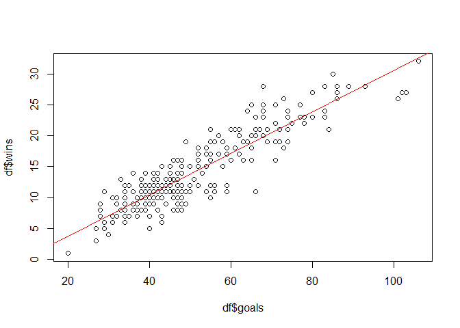

# What is Premier League?

The Premier League is the organising body of the Premier League with
responsibility for the competition, its Rule Book and the centralised
broadcast and other commercial rights.

Each individual club is independent, working within the rules of
football, as defined by the Premier League, The FA, UEFA and FIFA, as
well as being subject to English and European law.

Each of the 20 clubs are a Shareholder in the Premier League.
Consultation is at the heart of the Premier League and Shareholder
meetings are the ultimate decision-making forum for Premier League
policy and are held at regular intervals during the course of the
season.

The Premier League AGM takes place at the close of each season, at which
time the relegated clubs transfer their shares to the clubs promoted
into the Premier League from the Football League Championship.

*Note : Premier League is the Main League of England Football League/
First Devision*

# Data Analysis and EDA (Exploratory Data Analysis)

## Import Data

The first thing we should do is import the data to our notebook.

``` r
df <- read.csv("stats.csv")
df
```

    ##                         team wins losses goals total_yel_card total_red_card
    ## 1          Manchester United   28      5    83             60              1
    ## 2                    Chelsea   24      3    64             62              4
    ## 3                  Liverpool   20     10    57             44              0
    ## 4                    Arsenal   19      8    63             59              3
    ## 5          Tottenham Hotspur   17     12    57             48              3
    ## 6           Bolton Wanderers   16     14    47             84              4
    ## 7                    Reading   16     15    52             38              3
    ## 8           Blackburn Rovers   15     16    52             77              6
    ## 9                    Everton   15     10    52             65              2
    ## 10                Portsmouth   14     12    45             48              1
    ## 11             Middlesbrough   12     16    44             64              2
    ## 12           West Ham United   12     21    35             85              2
    ## 13               Aston Villa   11     10    43             48              1
    ## 14           Manchester City   11     18    29             59              4
    ## 15          Newcastle United   11     17    38             65              1
    ## 16          Sheffield United   10     20    32             68              2
    ## 17            Wigan Athletic   10     20    37             73              3
    ## 18         Charlton Athletic    8     20    34             56              4
    ## 19                    Fulham    8     15    38             56              3
    ## 20                   Watford    5     20    29             45              2
    ## 21         Manchester United   27      5    80             51              2
    ## 22                   Chelsea   25      3    65             63              5
    ## 23                   Arsenal   24      3    74             55              3
    ## 24                 Liverpool   21      4    67             45              1
    ## 25                   Everton   19     11    55             40              3
    ## 26               Aston Villa   16     10    71             54              4
    ## 27                Portsmouth   16     13    48             55              3
    ## 28          Blackburn Rovers   15     10    50             72              6
    ## 29           Manchester City   15     13    45             50              4
    ## 30           West Ham United   13     15    42             63              1
    ## 31          Newcastle United   11     17    45             63              1
    ## 32                Sunderland   11     21    36             65              4
    ## 33         Tottenham Hotspur   11     14    66             51              1
    ## 34             Middlesbrough   10     16    43             86              2
    ## 35                   Reading   10     22    41             59              5
    ## 36            Wigan Athletic   10     18    34             59              4
    ## 37          Bolton Wanderers    9     19    36             76              0
    ## 38           Birmingham City    8     19    46             70              3
    ## 39                    Fulham    8     18    38             55              6
    ## 40              Derby County    1     29    20             63              1
    ## 41         Manchester United   28      4    68             61              5
    ## 42                   Chelsea   25      5    68             50              3
    ## 43                 Liverpool   25      2    77             50              0
    ## 44                   Arsenal   20      6    68             58              3
    ## 45               Aston Villa   17     10    54             54              2
    ## 46                   Everton   17      9    55             49              1
    ## 47           Manchester City   15     18    58             49              4
    ## 48                    Fulham   14     13    39             40              1
    ## 49         Tottenham Hotspur   14     15    45             54              5
    ## 50           West Ham United   14     15    42             66              4
    ## 51                Stoke City   12     17    38             73              5
    ## 52            Wigan Athletic   12     17    34             59              4
    ## 53          Bolton Wanderers   11     19    41             62              1
    ## 54          Blackburn Rovers   10     17    40             74              4
    ## 55                Portsmouth   10     17    38             58              5
    ## 56                Sunderland    9     20    34             69              1
    ## 57                 Hull City    8     19    39             71              3
    ## 58      West Bromwich Albion    8     22    36             67              1
    ## 59             Middlesbrough    7     20    28             55              3
    ## 60          Newcastle United    7     18    40             57              8
    ## 61                   Chelsea   27      6   103             54              5
    ## 62         Manchester United   27      7    86             49              4
    ## 63                   Arsenal   23      9    83             56              1
    ## 64         Tottenham Hotspur   21     10    67             58              1
    ## 65                 Liverpool   18     11    61             55              5
    ## 66           Manchester City   18      7    73             49              2
    ## 67               Aston Villa   17      8    52             59              2
    ## 68                   Everton   16      9    60             57              2
    ## 69           Birmingham City   13     14    38             74              1
    ## 70          Blackburn Rovers   13     14    41             57              2
    ## 71                    Fulham   12     16    39             46              1
    ## 72                Stoke City   11     13    34             63              5
    ## 73                Sunderland   11     16    48             77              9
    ## 74          Bolton Wanderers   10     19    42             74              5
    ## 75            Wigan Athletic    9     20    37             65              3
    ## 76   Wolverhampton Wanderers    9     18    32             63              4
    ## 77                   Burnley    8     24    42             57              2
    ## 78           West Ham United    8     19    47             62              3
    ## 79                Portsmouth    7     24    34             68              5
    ## 80                 Hull City    6     20    34             64              6
    ## 81         Manchester United   23      4    78             56              3
    ## 82                   Chelsea   21      9    69             59              1
    ## 83           Manchester City   21      9    60             71              5
    ## 84                   Arsenal   19      8    72             65              6
    ## 85                 Liverpool   17     14    59             63              2
    ## 86         Tottenham Hotspur   16      8    55             51              2
    ## 87                   Everton   13     10    51             55              5
    ## 88                Stoke City   13     18    46             68              2
    ## 89               Aston Villa   12     14    48             71              2
    ## 90          Bolton Wanderers   12     16    52             67              5
    ## 91                Sunderland   12     15    45             57              5
    ## 92      West Bromwich Albion   12     15    56             52              7
    ## 93          Blackburn Rovers   11     17    46             65              5
    ## 94                    Fulham   11     11    49             52              1
    ## 95          Newcastle United   11     14    56             78              2
    ## 96   Wolverhampton Wanderers   11     20    46             62              2
    ## 97                 Blackpool   10     19    55             47              2
    ## 98            Wigan Athletic    9     14    40             67              4
    ## 99           Birmingham City    8     15    37             57              3
    ## 100          West Ham United    7     19    43             59              1
    ## 101          Manchester City   28      5    93             51              5
    ## 102        Manchester United   28      5    89             51              1
    ## 103                  Arsenal   21     10    74             64              4
    ## 104        Tottenham Hotspur   20      9    66             43              3
    ## 105         Newcastle United   19     11    56             67              2
    ## 106                  Chelsea   18     10    65             74              4
    ## 107                  Everton   15     12    50             60              2
    ## 108                   Fulham   14     14    48             54              0
    ## 109                Liverpool   14     14    47             53              5
    ## 110     West Bromwich Albion   13     17    45             48              1
    ## 111             Norwich City   12     15    52             58              3
    ## 112             Swansea City   12     15    44             40              2
    ## 113               Stoke City   11     15    36             60              2
    ## 114               Sunderland   11     15    45             60              4
    ## 115           Wigan Athletic   11     17    42             67              3
    ## 116         Bolton Wanderers   10     22    46             50              5
    ## 117      Queens Park Rangers   10     21    43             54              9
    ## 118         Blackburn Rovers    8     23    48             66              5
    ## 119              Aston Villa    7     14    37             70              2
    ## 120  Wolverhampton Wanderers    5     23    40             64              4
    ## 121        Manchester United   28      5    86             57              1
    ## 122          Manchester City   23      6    66             62              3
    ## 123                  Chelsea   22      7    75             51              3
    ## 124                  Arsenal   21      7    72             42              5
    ## 125        Tottenham Hotspur   21      8    66             55              2
    ## 126                  Everton   16      7    55             59              3
    ## 127                Liverpool   16      9    71             54              2
    ## 128     West Bromwich Albion   14     17    53             63              4
    ## 129          West Ham United   12     16    45             74              1
    ## 130                   Fulham   11     17    50             48              3
    ## 131         Newcastle United   11     19    45             71              4
    ## 132             Swansea City   11     14    47             58              2
    ## 133              Aston Villa   10     17    47             72              3
    ## 134             Norwich City   10     14    41             60              1
    ## 135              Southampton    9     15    49             43              2
    ## 136               Stoke City    9     14    34             78              4
    ## 137               Sunderland    9     17    41             62              3
    ## 138           Wigan Athletic    9     20    47             66              2
    ## 139                  Reading    6     22    43             45              1
    ## 140      Queens Park Rangers    4     21    30             59              3
    ## 141          Manchester City   27      6   102             72              1
    ## 142                Liverpool   26      6   101             54              1
    ## 143                  Chelsea   25      6    71             57              3
    ## 144                  Arsenal   24      7    68             53              4
    ## 145                  Everton   21      8    61             55              1
    ## 146        Tottenham Hotspur   21     11    55             66              4
    ## 147        Manchester United   19     12    64             66              3
    ## 148         Newcastle United   15     19    43             53              6
    ## 149              Southampton   15     12    54             60              0
    ## 150           Crystal Palace   13     19    33             58              2
    ## 151               Stoke City   13     14    45             72              5
    ## 152             Swansea City   11     18    54             55              3
    ## 153          West Ham United   11     20    40             62              5
    ## 154              Aston Villa   10     20    39             78              0
    ## 155                Hull City   10     21    38             53              4
    ## 156               Sunderland   10     20    41             69              7
    ## 157                   Fulham    9     24    40             58              1
    ## 158             Norwich City    8     21    28             62              2
    ## 159             Cardiff City    7     22    32             49              1
    ## 160     West Bromwich Albion    7     16    43             67              0
    ## 161                  Chelsea   26      3    73             73              4
    ## 162          Manchester City   24      7    83             77              2
    ## 163                  Arsenal   22      7    71             68              2
    ## 164        Manchester United   20      8    62             64              5
    ## 165        Tottenham Hotspur   19     12    58             79              4
    ## 166                Liverpool   18     12    52             66              3
    ## 167              Southampton   18     14    54             57              3
    ## 168             Swansea City   16     14    46             48              5
    ## 169               Stoke City   15     14    48             82              1
    ## 170           Crystal Palace   13     16    47             63              4
    ## 171                  Everton   12     15    48             66              2
    ## 172          West Ham United   12     15    44             64              2
    ## 173           Leicester City   11     19    46             49              4
    ## 174     West Bromwich Albion   11     16    38             64              3
    ## 175              Aston Villa   10     20    31             70              7
    ## 176         Newcastle United   10     19    40             65              7
    ## 177                Hull City    8     19    33             73              6
    ## 178      Queens Park Rangers    8     24    42             75              3
    ## 179                  Burnley    7     19    28             64              2
    ## 180               Sunderland    7     14    31             94              2
    ## 181           Leicester City   23      3    68             48              3
    ## 182                  Arsenal   20      7    65             40              4
    ## 183          Manchester City   19     10    71             61              0
    ## 184        Manchester United   19     10    49             65              1
    ## 185        Tottenham Hotspur   19      6    69             72              0
    ## 186              Southampton   18     11    59             57              6
    ## 187                Liverpool   16     10    63             61              3
    ## 188          West Ham United   16      8    65             58              5
    ## 189               Stoke City   14     15    41             51              4
    ## 190                  Chelsea   12     12    59             58              5
    ## 191             Swansea City   12     15    42             60              1
    ## 192                  Watford   12     17    40             73              3
    ## 193          AFC Bournemouth   11     18    45             53              1
    ## 194           Crystal Palace   11     18    39             60              2
    ## 195                  Everton   11     13    59             44              5
    ## 196     West Bromwich Albion   10     15    34             65              3
    ## 197         Newcastle United    9     19    44             60              5
    ## 198             Norwich City    9     22    39             61              3
    ## 199               Sunderland    9     17    48             64              2
    ## 200              Aston Villa    3     27    27             75              3
    ## 201                  Chelsea   30      5    85             72              0
    ## 202        Tottenham Hotspur   26      4    86             62              0
    ## 203                  Arsenal   23      9    77             68              3
    ## 204          Manchester City   23      6    80             71              4
    ## 205                Liverpool   22      6    78             54              0
    ## 206        Manchester United   18      5    54             78              2
    ## 207                  Everton   17     11    62             72              2
    ## 208          AFC Bournemouth   12     16    55             52              3
    ## 209           Crystal Palace   12     21    50             77              0
    ## 210           Leicester City   12     18    48             72              1
    ## 211              Southampton   12     16    41             59              2
    ## 212             Swansea City   12     21    45             56              0
    ## 213     West Bromwich Albion   12     17    43             80              0
    ## 214          West Ham United   12     17    47             78              5
    ## 215                  Burnley   11     20    39             65              2
    ## 216               Stoke City   11     16    41             70              2
    ## 217                  Watford   11     20    40             84              5
    ## 218                Hull City    9     22    37             67              5
    ## 219               Sunderland    6     26    29             78              4
    ## 220            Middlesbrough    5     20    27             77              1
    ## 221          Manchester City   32      2   106             59              2
    ## 222        Manchester United   25      7    68             64              1
    ## 223        Tottenham Hotspur   23      7    74             50              2
    ## 224                  Chelsea   21     10    62             42              4
    ## 225                Liverpool   21      5    84             44              1
    ## 226                  Arsenal   19     13    74             57              2
    ## 227                  Burnley   14     12    36             65              0
    ## 228                  Everton   13     15    44             51              3
    ## 229           Leicester City   12     15    56             52              5
    ## 230         Newcastle United   12     18    39             52              2
    ## 231          AFC Bournemouth   11     16    45             55              1
    ## 232           Crystal Palace   11     16    45             72              0
    ## 233                  Watford   11     19    44             63              4
    ## 234          West Ham United   10     16    48             73              2
    ## 235 Brighton and Hove Albion    9     16    34             54              2
    ## 236        Huddersfield Town    9     19    28             62              3
    ## 237             Swansea City    8     21    28             51              1
    ## 238              Southampton    7     16    37             63              2
    ## 239               Stoke City    7     19    35             62              1
    ## 240     West Bromwich Albion    6     19    31             73              1
    ##     total_scoring_att ontarget_scoring_att hit_woodwork att_hd_goal
    ## 1                 698                  256           21          12
    ## 2                 636                  216           14          16
    ## 3                 668                  214           15           8
    ## 4                 638                  226           19          10
    ## 5                 520                  184            6           5
    ## 6                 404                  120            7          10
    ## 7                 419                  132            8          15
    ## 8                 478                  155            5          12
    ## 9                 465                  153            9           9
    ## 10                525                  186            9          13
    ## 11                454                  144            7           7
    ## 12                461                  134            8           3
    ## 13                470                  154            9           5
    ## 14                454                  147            5           3
    ## 15                454                  140           11           8
    ## 16                483                  147           14          10
    ## 17                474                  147            9           6
    ## 18                418                  133           11           6
    ## 19                451                  142            8           8
    ## 20                418                  135           10           4
    ## 21                696                  260           16          12
    ## 22                605                  199           12          10
    ## 23                627                  208           13          14
    ## 24                686                  214           13           7
    ## 25                474                  169            4          13
    ## 26                511                  182           11          16
    ## 27                559                  160            9           4
    ## 28                530                  185           14          11
    ## 29                423                  143            5           5
    ## 30                500                  154           15           7
    ## 31                481                  153           10          10
    ## 32                483                  137            7          10
    ## 33                555                  195           19          12
    ## 34                499                  152           13           9
    ## 35                441                  132           10          12
    ## 36                489                  141           11           6
    ## 37                451                  149           14           5
    ## 38                414                  143            6           6
    ## 39                469                  154            7           7
    ## 40                376                  116            7           3
    ## 41                715                  230            9           7
    ## 42                797                  248           17          12
    ## 43                736                  224           26          14
    ## 44                662                  220           22          14
    ## 45                472                  159           15          10
    ## 46                496                  169           12          14
    ## 47                572                  201           11           3
    ## 48                511                  149           11           2
    ## 49                544                  177            7           5
    ## 50                515                  167           12           4
    ## 51                364                  100           11          14
    ## 52                590                  163           10           3
    ## 53                488                  154            7          10
    ## 54                473                  148           13           9
    ## 55                500                  152           19          10
    ## 56                473                  144           10           8
    ## 57                476                  149            9          13
    ## 58                559                  165           16           4
    ## 59                498                  140            7           1
    ## 60                444                  125           12          10
    ## 61                834                  288           13          16
    ## 62                695                  221           12          14
    ## 63                660                  233           15          11
    ## 64                681                  226           13          12
    ## 65                642                  189           20           6
    ## 66                526                  195            9           9
    ## 67                497                  158            5          12
    ## 68                589                  194           12          16
    ## 69                452                  155            7           3
    ## 70                489                  161           18          11
    ## 71                463                  144            7           4
    ## 72                402                  113            5           9
    ## 73                444                  159           11          10
    ## 74                558                  163           10          10
    ## 75                555                  174           13          10
    ## 76                436                  119            8           6
    ## 77                459                  153           14           6
    ## 78                549                  191           12          13
    ## 79                533                  151            7           7
    ## 80                388                  120            6           8
    ## 81                618                  212           15          18
    ## 82                745                  244           21          12
    ## 83                546                  177           16           4
    ## 84                654                  238           23           9
    ## 85                582                  205           12           8
    ## 86                657                  191           15          10
    ## 87                580                  181            8          14
    ## 88                482                  143           20          11
    ## 89                506                  165           19          13
    ## 90                570                  173            9          10
    ## 91                532                  154           10           7
    ## 92                597                  184           12          10
    ## 93                453                  135           10           9
    ## 94                547                  172           10          15
    ## 95                507                  168           10          15
    ## 96                459                  139           14          10
    ## 97                531                  161           11           8
    ## 98                511                  170            9           3
    ## 99                401                  121           11          10
    ## 100               572                  174           18           9
    ## 101               738                  250           21          10
    ## 102               646                  243           17          16
    ## 103               637                  236           15           9
    ## 104               701                  230           12           5
    ## 105               489                  154           19           6
    ## 106               671                  224           20          12
    ## 107               520                  164           12           9
    ## 108               541                  195           24           7
    ## 109               667                  207           33           8
    ## 110               544                  167           13           9
    ## 111               514                  164            7          15
    ## 112               472                  145           14           7
    ## 113               376                   94            7          14
    ## 114               458                  141           11           8
    ## 115               519                  162           13           6
    ## 116               495                  163            8           7
    ## 117               539                  150           15          10
    ## 118               453                  143           10          13
    ## 119               438                  138            9           3
    ## 120               473                  152           10           9
    ## 121               561                  213           24          14
    ## 122               660                  231           16           6
    ## 123               626                  212            7          16
    ## 124               597                  205           16          11
    ## 125               681                  241           17           6
    ## 126               633                  207           21          13
    ## 127               739                  232           19           9
    ## 128               506                  170           15          13
    ## 129               492                  158            9           9
    ## 130               460                  160           19          10
    ## 131               533                  174           12           6
    ## 132               504                  167           11           7
    ## 133               438                  141           10           7
    ## 134               413                  134            7          13
    ## 135               516                  167           16           9
    ## 136               390                  114           12           9
    ## 137               417                  139            7           2
    ## 138               500                  170            7           9
    ## 139               394                  128            9          12
    ## 140               500                  146            9           4
    ## 141               673                  238           19          10
    ## 142               651                  258           27          14
    ## 143               692                  229           19           6
    ## 144               523                  213           15          12
    ## 145               561                  196           14           6
    ## 146               588                  192           12           6
    ## 147               526                  183           16          10
    ## 148               579                  182           14           8
    ## 149               534                  179           16          10
    ## 150               414                  143            9           6
    ## 151               428                  137           14           2
    ## 152               496                  161            7           9
    ## 153               422                  122           11           5
    ## 154               431                  135           11          10
    ## 155               427                  132           16          10
    ## 156               491                  138           10           7
    ## 157               431                  149           11           7
    ## 158               467                  148           15           7
    ## 159               418                  124           10           9
    ## 160               487                  146            6           6
    ## 161               564                  210           15          10
    ## 162               670                  229           18           5
    ## 163               610                  227           13          10
    ## 164               512                  180           11          12
    ## 165               527                  171           11           8
    ## 166               590                  192           12           5
    ## 167               509                  169           17           3
    ## 168               426                  147           12           5
    ## 169               500                  136            9          14
    ## 170               441                  139           14          10
    ## 171               483                  166           11          10
    ## 172               488                  152           13          15
    ## 173               456                  137           12           7
    ## 174               412                  132           10          16
    ## 175               418                  125            5           7
    ## 176               468                  143            6           7
    ## 177               428                  131           11          10
    ## 178               534                  150           16          10
    ## 179               430                  125           13           8
    ## 180               408                  130           11           8
    ## 181               522                  179           11          11
    ## 182               571                  211           21          13
    ## 183               615                  210           15          13
    ## 184               430                  144            9           5
    ## 185               659                  252           19           7
    ## 186               519                  166           13          15
    ## 187               629                  202           16          12
    ## 188               558                  185           19          15
    ## 189               419                  128            5           9
    ## 190               526                  173            4           6
    ## 191               441                  136           14           6
    ## 192               446                  140            9           5
    ## 193               464                  143            8          11
    ## 194               469                  153           12           7
    ## 195               491                  175           18          10
    ## 196               388                  107           10          12
    ## 197               397                  151            6          12
    ## 198               418                  129           11           3
    ## 199               439                  141           10           2
    ## 200               380                  110            7           6
    ## 201               580                  204           17           8
    ## 202               669                  257           22          10
    ## 203               566                  201           17          17
    ## 204               633                  216           20           8
    ## 205               640                  236           18          12
    ## 206               591                  210           19           9
    ## 207               502                  191           12          13
    ## 208               452                  160           19           5
    ## 209               439                  138            8          13
    ## 210               433                  145            8          10
    ## 211               550                  179           12           4
    ## 212               405                  145           10          15
    ## 213               399                  123           11          16
    ## 214               499                  138           14          14
    ## 215               391                  120            5           4
    ## 216               425                  137           14           7
    ## 217               422                  143            7           9
    ## 218               397                  126           10           5
    ## 219               387                  119            4           1
    ## 220               351                  100            6           8
    ## 221               665                  265           23          12
    ## 222               512                  178           16          12
    ## 223               623                  216           13          11
    ## 224               606                  220           11          17
    ## 225               638                  233           16          12
    ## 226               594                  234           17          13
    ## 227               378                  128            9          10
    ## 228               359                  121            7           8
    ## 229               423                  149            8           9
    ## 230               451                  149           12           7
    ## 231               465                  158           10           4
    ## 232               476                  151            8           4
    ## 233               440                  132            8           9
    ## 234               372                  133           14           6
    ## 235               384                  119            8           7
    ## 236               362                  109            8           5
    ## 237               338                  103            8           3
    ## 238               450                  145           15           7
    ## 239               384                  132            8           8
    ## 240               378                  114            7          10
    ##     att_pen_goal att_freekick_goal att_ibox_goal att_obox_goal goal_fastbreak
    ## 1              5                 1            72            11              9
    ## 2              3                 6            41            23              6
    ## 3              6                 1            46            11              3
    ## 4             10                 3            53            10              7
    ## 5              6                 2            44            13              9
    ## 6              6                 0            38             9              3
    ## 7              3                 0            42            10              3
    ## 8              5                 3            43             9              2
    ## 9              8                 2            44             8              3
    ## 10             2                 0            32            13              2
    ## 11             4                 1            37             7              3
    ## 12             1                 2            27             8              3
    ## 13             6                 1            34             9              6
    ## 14             2                 0            23             6              5
    ## 15             5                 0            30             8              6
    ## 16             2                 2            25             7              2
    ## 17             3                 1            31             6              2
    ## 18             4                 1            27             7              2
    ## 19             3                 1            30             8              0
    ## 20             3                 0            24             5              0
    ## 21             6                 6            64            16              7
    ## 22             7                 1            52            13              3
    ## 23             5                 1            65             9              7
    ## 24             5                 2            51            16              7
    ## 25             1                 1            48             7              7
    ## 26             6                 5            55            16              3
    ## 27             4                 2            35            13              6
    ## 28             5                 1            40            10              3
    ## 29             2                 2            34            11              3
    ## 30             2                 2            34             8              3
    ## 31             4                 2            34            10              1
    ## 32             1                 0            31             5              2
    ## 33             4                 1            59             7              9
    ## 34             2                 2            37             6              6
    ## 35             2                 1            35             6              3
    ## 36             4                 1            28             6              3
    ## 37             0                 2            30             6              2
    ## 38             6                 5            34            12              1
    ## 39             2                 4            29             9              3
    ## 40             0                 0            15             5              2
    ## 41             4                 4            56            12             12
    ## 42             2                 2            59             9              4
    ## 43             5                 2            65            12              4
    ## 44             5                 0            62             6              7
    ## 45             4                 2            44            10             10
    ## 46             4                 4            47             8              0
    ## 47             6                 2            52             6              8
    ## 48             5                 0            33             6              5
    ## 49             3                 0            39             6              7
    ## 50             1                 1            37             5              4
    ## 51             5                 0            35             3              1
    ## 52             5                 2            29             5              2
    ## 53             0                 3            35             6              2
    ## 54             4                 1            35             5              0
    ## 55             2                 1            32             6              2
    ## 56             1                 1            27             7              4
    ## 57             3                 3            33             6              5
    ## 58             3                 3            31             5              5
    ## 59             1                 2            25             3              0
    ## 60             4                 0            38             2              2
    ## 61            11                 3            94             9              8
    ## 62             6                 3            77             9              6
    ## 63             3                 2            65            18              9
    ## 64             2                 2            59             8              6
    ## 65             3                 0            53             8              4
    ## 66             5                 3            63            10             10
    ## 67             5                 0            44             8              4
    ## 68             5                 2            52             8              2
    ## 69             2                 4            30             8              4
    ## 70             3                 0            35             6              2
    ## 71             4                 2            30             9              0
    ## 72             2                 0            32             2              1
    ## 73             6                 1            44             4              6
    ## 74             4                 2            38             4              0
    ## 75             1                 2            32             5              1
    ## 76             2                 0            29             3              0
    ## 77             6                 2            38             4              2
    ## 78             7                 1            41             6              0
    ## 79             3                 1            31             3              2
    ## 80             6                 2            27             7              1
    ## 81             3                 1            71             7              5
    ## 82             6                 2            61             8              4
    ## 83             8                 2            51             9              2
    ## 84             4                 1            67             5              3
    ## 85             6                 1            54             5              3
    ## 86             5                 0            40            15              3
    ## 87             3                 2            43             8              4
    ## 88             3                 2            42             4              4
    ## 89             4                 2            42             6              4
    ## 90             4                 1            44             8              3
    ## 91             4                 1            40             5              2
    ## 92             4                 1            50             6              3
    ## 93             1                 2            39             7              1
    ## 94             2                 2            42             7              2
    ## 95             5                 0            50             6              1
    ## 96             3                 1            41             5              1
    ## 97             7                 3            44            11              3
    ## 98             2                 5            32             8              5
    ## 99             2                 0            34             3              1
    ## 100            5                 0            38             5              1
    ## 101            7                 1            73            20              6
    ## 102            9                 2            74            15              2
    ## 103            2                 2            64            10              9
    ## 104            4                 1            52            14              5
    ## 105            2                 3            44            12              4
    ## 106            4                 0            60             5              2
    ## 107            5                 1            42             8              1
    ## 108            3                 2            42             6              3
    ## 109            1                 2            40             7              3
    ## 110            1                 2            35            10              3
    ## 111            2                 1            47             5              4
    ## 112            5                 1            36             8              1
    ## 113            4                 0            33             3              1
    ## 114            1                 5            32            13              3
    ## 115            5                 1            29            13              2
    ## 116            5                 0            40             6              0
    ## 117            2                 3            36             7              0
    ## 118            4                 2            41             7              2
    ## 119            3                 0            29             8              1
    ## 120            3                 0            37             3              1
    ## 121            4                 1            77             9              2
    ## 122            4                 2            57             9              6
    ## 123            9                 3            64            11              3
    ## 124            5                 2            65             7              7
    ## 125            0                 2            50            16              6
    ## 126            2                 1            44            11              4
    ## 127            5                 3            59            12              1
    ## 128            5                 0            46             7              5
    ## 129            4                 2            38             7              2
    ## 130            6                 1            43             7              2
    ## 131            4                 3            34            11              2
    ## 132            0                 1            41             6              2
    ## 133            3                 1            35            12              6
    ## 134            1                 4            36             5              0
    ## 135            3                 2            45             4              2
    ## 136            3                 0            33             1              1
    ## 137            4                 1            33             8              3
    ## 138            1                 2            42             5              3
    ## 139            4                 1            39             4              2
    ## 140            1                 0            18            12              3
    ## 141            6                 5            86            16              5
    ## 142           10                 6            82            19              9
    ## 143            5                 2            54            17              5
    ## 144            3                 0            63             5              4
    ## 145            3                 5            49            12              3
    ## 146            5                 2            45            10              4
    ## 147            5                 5            53            11              1
    ## 148            2                 1            35             8              3
    ## 149            3                 2            46             8              2
    ## 150            5                 1            28             5              2
    ## 151            4                 2            31            14              3
    ## 152            4                 0            45             9              0
    ## 153            2                 1            36             4              2
    ## 154            2                 3            33             6              4
    ## 155            2                 1            30             8              2
    ## 156            6                 1            37             4              4
    ## 157            2                 1            31             9              1
    ## 158            1                 1            19             9              1
    ## 159            1                 0            28             4              0
    ## 160            2                 0            35             8              1
    ## 161            4                 1            66             7              1
    ## 162            7                 3            68            15              9
    ## 163            6                 3            62             9              2
    ## 164            3                 2            55             7              2
    ## 165            3                 4            47            11              2
    ## 166            5                 1            44             8              2
    ## 167            2                 0            50             4              0
    ## 168            2                 2            38             8              1
    ## 169            3                 0            41             7              1
    ## 170            5                 4            41             6              0
    ## 171            4                 1            40             8              5
    ## 172            1                 1            35             9              1
    ## 173            3                 0            38             8              3
    ## 174            4                 0            35             3              1
    ## 175            1                 1            28             3              2
    ## 176            1                 0            34             6              1
    ## 177            1                 0            30             3              2
    ## 178            3                 1            34             8              1
    ## 179            1                 1            24             4              0
    ## 180            4                 2            25             6              2
    ## 181           10                 0            65             3              6
    ## 182            1                 1            61             4              3
    ## 183            5                 0            57            14              5
    ## 184            3                 1            44             5              2
    ## 185            5                 2            59            10              3
    ## 186            3                 1            53             6              3
    ## 187            2                 1            48            15              1
    ## 188            4                 4            55            10              2
    ## 189            5                 0            33             8              0
    ## 190            4                 4            48            11              1
    ## 191            5                 3            35             7              3
    ## 192            6                 1            37             3              0
    ## 193            3                 0            39             6              0
    ## 194            4                 1            33             6              0
    ## 195            4                 0            53             6              2
    ## 196            1                 1            31             3              0
    ## 197            3                 1            38             6              4
    ## 198            1                 0            33             6              0
    ## 199            3                 4            40             8              2
    ## 200            2                 0            21             6              1
    ## 201            2                 3            73            12              7
    ## 202            7                 0            74            12              3
    ## 203            4                 2            70             7              2
    ## 204            7                 2            73             7              6
    ## 205            7                 3            65            13              3
    ## 206            3                 1            47             7              5
    ## 207            3                 2            59             3              2
    ## 208            7                 0            51             5              2
    ## 209            4                 0            48             2              0
    ## 210            4                 1            39             9              4
    ## 211            3                 0            37             4              0
    ## 212            3                 2            40             5              1
    ## 213            1                 1            37             6              3
    ## 214            3                 3            41             6              3
    ## 215            6                 3            31             8              2
    ## 216            4                 2            36             5              0
    ## 217            3                 0            36             4              0
    ## 218            3                 2            33             4              3
    ## 219            5                 0            26             3              0
    ## 220            2                 0            26             1              3
    ## 221            6                 1            93            13              4
    ## 222            1                 2            56            13              4
    ## 223            2                 1            64            11              8
    ## 224            3                 2            52            10              1
    ## 225            2                 2            75             9              9
    ## 226            4                 1            68             7              0
    ## 227            0                 1            32             4              0
    ## 228            5                 0            36             8              2
    ## 229            5                 1            49             7              7
    ## 230            0                 1            34             5              5
    ## 231            3                 1            38             7              0
    ## 232            8                 1            39             6              3
    ## 233            3                 0            38             6              1
    ## 234            2                 1            39            10              4
    ## 235            5                 0            30             4              0
    ## 236            2                 0            27             1              2
    ## 237            1                 0            24             4              0
    ## 238            3                 1            34             3              2
    ## 239            0                 1            28             8              2
    ## 240            1                 1            29             2              2
    ##     total_offside clean_sheet goals_conceded saves outfielder_block
    ## 1              80          16             27     2               81
    ## 2             127          22             24     4               74
    ## 3             120          20             27     1               65
    ## 4             111          12             35     6               73
    ## 5             149           6             54    11              128
    ## 6              95          12             52    13              101
    ## 7              87          13             47     4               95
    ## 8             142           8             54    22              114
    ## 9              81          14             36     5              120
    ## 10            141          12             42    14               96
    ## 11             89           9             49    18              119
    ## 12             92           9             59     4              132
    ## 13            147          13             41     1              115
    ## 14            142          14             44     0              110
    ## 15            102           7             47     5              141
    ## 16             82           9             55     3              122
    ## 17             84          10             59    13               91
    ## 18             96          11             60     5              138
    ## 19             94           7             60    12               98
    ## 20            122           9             59    17              117
    ## 21            100          21             22     2               96
    ## 22            128          21             26     4              101
    ## 23            110          15             31     0               91
    ## 24             93          18             28     0               83
    ## 25             73          14             33     0              133
    ## 26            115           9             51     3              139
    ## 27             95          16             40     4              105
    ## 28             95           8             48     0              116
    ## 29            103          11             53     4              151
    ## 30            117           8             50     1              142
    ## 31            102           8             65     0              132
    ## 32             75           7             59     0              125
    ## 33            123           9             61     0              125
    ## 34            126           8             53     0              136
    ## 35             60           8             66     7              128
    ## 36            137          12             51     5              129
    ## 37            111          12             54     0              145
    ## 38             78           3             62     0              143
    ## 39             91           7             60     0              119
    ## 40            103           3             89     8              129
    ## 41             99          24             24    NA              120
    ## 42            114          22             24    NA              124
    ## 43             98          20             27    NA               66
    ## 44             88          16             37    NA               87
    ## 45             85          13             48    NA              146
    ## 46             99          17             37    NA              146
    ## 47             79          10             50    NA              124
    ## 48             92          15             34    NA              153
    ## 49             85          13             45    NA              122
    ## 50            130          10             45    NA              190
    ## 51             65          12             55    NA              169
    ## 52            101          13             45    NA              110
    ## 53             71           7             53    NA              183
    ## 54            119          10             60    NA              119
    ## 55             81           8             57    NA              113
    ## 56             96           9             54    NA              173
    ## 57            141           6             64    NA              160
    ## 58            101           8             67    NA              136
    ## 59            121           7             57    NA              144
    ## 60             73           7             59    NA              142
    ## 61             96          18             32     0              103
    ## 62             85          19             28     0              100
    ## 63             93          14             41     3               89
    ## 64            117          13             41     4              129
    ## 65             62          17             35     0               81
    ## 66            120          11             45     0              120
    ## 67             81          15             39     0              225
    ## 68             94          11             49     0              137
    ## 69             98          11             47     0              193
    ## 70            124          13             55     0              132
    ## 71             92          12             46     5              147
    ## 72             86          14             48     4              184
    ## 73             93           7             56     0              162
    ## 74             58           5             67     0              147
    ## 75             50           8             79     0              131
    ## 76             65           8             56     0              127
    ## 77             66           3             82     0              147
    ## 78             92           8             66     4              160
    ## 79             93           7             66     0              135
    ## 80             86           7             75     0              157
    ## 81            102          15             37     0              107
    ## 82            113          15             33     0              127
    ## 83            103          18             33     2              130
    ## 84             93          13             43     0               94
    ## 85             87          14             44     0              128
    ## 86             59           8             46     0              139
    ## 87             78           9             45     0              149
    ## 88             74           9             48     0              156
    ## 89             92           7             59     0              183
    ## 90             57           5             56     0              150
    ## 91             98          13             56     0              134
    ## 92            102           2             71     0              126
    ## 93             87           8             59     0              183
    ## 94            100          14             43     0              120
    ## 95             82           9             57     0              134
    ## 96             93           5             66     0              151
    ## 97             97           6             78     3              206
    ## 98             71           7             61     0              116
    ## 99             91           9             58     0              179
    ## 100           120           5             70     0              184
    ## 101            85          17             29     1              111
    ## 102            89          20             33     0              138
    ## 103            88          13             49     0               93
    ## 104            93          14             41     0              122
    ## 105            97          15             51     1              143
    ## 106            70          10             46     1              111
    ## 107           116          12             40     2              145
    ## 108            85          11             51     0              141
    ## 109           128          12             40     0              108
    ## 110           128          10             52     4              167
    ## 111            74           3             66     0              157
    ## 112            67          14             51     0              146
    ## 113            62           9             53    11              157
    ## 114            76          12             46     0              194
    ## 115            71           8             62     0              129
    ## 116            55           3             77     0              169
    ## 117            83           7             66     0              187
    ## 118            58           3             78     0              149
    ## 119            85           9             53     0              176
    ## 120            82           4             82     9              159
    ## 121            96          13             43     1              143
    ## 122            75          18             34     1              111
    ## 123            80          14             39     6              104
    ## 124            80          14             37     0               94
    ## 125            77           9             46     0               90
    ## 126           100          11             40     4              126
    ## 127           110          16             43     0              107
    ## 128           100           8             57     2              158
    ## 129            82          11             53     2              166
    ## 130            74           8             60     0              161
    ## 131            84           6             68     0              115
    ## 132            87          10             51     0              157
    ## 133            97           5             69     2              177
    ## 134            97          10             58     0              141
    ## 135            86           7             60     0              109
    ## 136            72          12             45     9              159
    ## 137            68          11             54     0              178
    ## 138            83           5             73     0              135
    ## 139            80           5             73     0              166
    ## 140           108           7             60     0              174
    ## 141            59          16             37    88               61
    ## 142            78          10             50   107              127
    ## 143           106          18             27    96               95
    ## 144            74          17             41   116              101
    ## 145            80          15             39   117              130
    ## 146            64          14             51   106               81
    ## 147            97          13             43   103              108
    ## 148            78          10             59   108              101
    ## 149            97          15             46    85               66
    ## 150            71          12             48   119              139
    ## 151            81           9             52   127              153
    ## 152            76           8             54    96              117
    ## 153            76          14             51   151              199
    ## 154            84           9             61   110              126
    ## 155            86          10             53   106              146
    ## 156            70          11             60   160              144
    ## 157            86           5             85   154              182
    ## 158            48          12             62   125              154
    ## 159            81           7             74   157              178
    ## 160            91           7             59   114              125
    ## 161            75          17             32    90              102
    ## 162            78          14             38    93               98
    ## 163            64          13             36    96              106
    ## 164            87          11             37   100               96
    ## 165            77           9             53   119              117
    ## 166            75          14             48    93              105
    ## 167            93          15             33    80               94
    ## 168            80          13             49   141              146
    ## 169            75           9             45    96              134
    ## 170            77           7             51    94              154
    ## 171            83          10             50    80              167
    ## 172            91           9             47   133              165
    ## 173            60          10             55   124              161
    ## 174            65          16             51   131              155
    ## 175            70          10             57   112              135
    ## 176            38           8             63    98              100
    ## 177            72          10             51   102              158
    ## 178            81           6             73   142              159
    ## 179            64          10             53   128              180
    ## 180            69          13             53   144              168
    ## 181            50          15             36    99              166
    ## 182            86          18             36   118              128
    ## 183            63          16             41    86               66
    ## 184            75          18             35    90               96
    ## 185            72          13             35    89              140
    ## 186            98          12             41    94              136
    ## 187            91          11             50    81              108
    ## 188            82          11             51   111              162
    ## 189           103          10             55   121              149
    ## 190            90           9             53   122              136
    ## 191            82           9             52   119              134
    ## 192            52          11             50   121              111
    ## 193            66           7             67    90              106
    ## 194            81           8             51   122              176
    ## 195            55          10             55   127              160
    ## 196            68          11             48   109              172
    ## 197            59           8             65   115              155
    ## 198            93           5             67   103              108
    ## 199            88           7             62   156              144
    ## 200            42           6             76   116              111
    ## 201            64          16             33    69               78
    ## 202            74          17             26    85               99
    ## 203            95          13             44   124               95
    ## 204            89          12             39    64               66
    ## 205            77          12             42    73               65
    ## 206            99          17             29    85               99
    ## 207            82          13             44    96              149
    ## 208            53          10             67   123              150
    ## 209            55           7             63   108              125
    ## 210            65           9             63   131              141
    ## 211            73          14             48    76              128
    ## 212            49           8             70   121              136
    ## 213            59           6             51   116              150
    ## 214            74          10             64   117              112
    ## 215           101          10             55   151              221
    ## 216            85          11             56   127              159
    ## 217            61           7             68   121              140
    ## 218            71           5             80   137              184
    ## 219            78           6             69   176              171
    ## 220            51          11             53   117              149
    ## 221            67          18             27    62               53
    ## 222            88          19             28   118              112
    ## 223            88          16             36    93               74
    ## 224           108          16             38    83              107
    ## 225            70          17             38    67               71
    ## 226            89          13             51   100              104
    ## 227           100          12             39   122              191
    ## 228            82          10             58   121              160
    ## 229            92           9             60   107              130
    ## 230            63           9             47   105              117
    ## 231            52           6             61   111              160
    ## 232            56           9             55   122              117
    ## 233            74           9             64    95               98
    ## 234            97          10             68   122              154
    ## 235            98          10             54   124              190
    ## 236            67          10             58   103              118
    ## 237            38           9             56   137              124
    ## 238            73           8             56   110              128
    ## 239            87           6             68   152              142
    ## 240            79          10             56   102              148
    ##     interception total_tackle last_man_tackle total_clearance head_clearance
    ## 1            254          890               1            1222             NA
    ## 2            292          982               0            1206             NA
    ## 3            246          969               2            1115             NA
    ## 4            214          998               1            1202             NA
    ## 5            276          995               2            1412             NA
    ## 6            235          811               0            1037             NA
    ## 7            277          855               0            1022             NA
    ## 8            282          864               2            1095             NA
    ## 9            303          860               1            1386             NA
    ## 10           220          948               1            1164             NA
    ## 11           238          841               1            1243             NA
    ## 12           233          860               1            1232             NA
    ## 13           221          936               0            1212             NA
    ## 14           234          986               1            1213             NA
    ## 15           361          965               0            1004             NA
    ## 16           203          917               2            1217             NA
    ## 17           204          809               0            1206             NA
    ## 18           340          919               0            1483             NA
    ## 19           198          901               0            1386             NA
    ## 20           221          744               1            1179             NA
    ## 21           446          978               2            2022           1140
    ## 22           506          917               4            1687            851
    ## 23           505          878               1            1840            926
    ## 24           614         1089               2            1952           1060
    ## 25           496          816               2            2136           1006
    ## 26           461          885               0            2220           1183
    ## 27           521          963               1            2103           1029
    ## 28           550          833               3            2065           1003
    ## 29           482          916               3            1852            819
    ## 30           444          848               1            1952            978
    ## 31           553          876               1            1823            874
    ## 32           650          892               0            2051           1031
    ## 33           534          960               2            2043           1053
    ## 34           528          835               0            2139           1043
    ## 35           452          800               2            1783            859
    ## 36           531          883               3            1837            917
    ## 37           542          866               3            2166           1128
    ## 38           515          935               3            2145           1023
    ## 39           466          851               2            2072            938
    ## 40           510          898               5            2042            976
    ## 41           640          741               8            1322            716
    ## 42           504          773              15            1069            585
    ## 43           657          927               5            1279            722
    ## 44           872          875               6            1280            738
    ## 45           710          982              11            1764           1088
    ## 46           660          775              12            1602            854
    ## 47           740          939              18            1496            828
    ## 48           667          812              10            1632           1011
    ## 49           743          781               7            1511            886
    ## 50           606          896              13            1601            867
    ## 51           574          688              11            1555            926
    ## 52           685          934              12            1636            927
    ## 53           555          890              14            1880           1023
    ## 54           557          824              14            1649            900
    ## 55           653          922              17            1552            892
    ## 56           609          888               6            1596            978
    ## 57           624          811              15            1677            967
    ## 58           591          803              14            1477            776
    ## 59           607          784              23            1582            846
    ## 60           591          735              22            1278            693
    ## 61           705          772              10            1055            560
    ## 62           602          828              13             983            584
    ## 63           839          818              26            1091            640
    ## 64           804          844              10            1360            729
    ## 65           763          958               6            1094            603
    ## 66           805          802              18            1269            689
    ## 67           690          880               6            1531            877
    ## 68           827          768              19            1601            880
    ## 69           777          785               4            1499            815
    ## 70           730          709              12            1557            832
    ## 71           752          745              10            1459            785
    ## 72           738          724               8            1632           1010
    ## 73           829          890              10            1641            904
    ## 74           735          912              15            1638            936
    ## 75           743          908              13            1353            666
    ## 76           537          705              15            1618            784
    ## 77           661          686              13            1552            775
    ## 78           755          830              10            1623            870
    ## 79           681          774              14            1356            751
    ## 80           674          760              12            1528            805
    ## 81           646          693              17            1053            634
    ## 82           616          769              19             762            470
    ## 83           629          826               4            1206            680
    ## 84           709          772               3            1077            580
    ## 85           592          908               2            1073            563
    ## 86           661          754              16            1363            800
    ## 87           470          768              12            1265            652
    ## 88           532          716              13            1316            791
    ## 89           667          844              16            1116            621
    ## 90           627          939              17            1466            854
    ## 91           694          820              17            1291            686
    ## 92           662          725              10            1088            609
    ## 93           734          748              11            1521            799
    ## 94           668          799               5            1513            878
    ## 95           608          666              11            1025            598
    ## 96           520          677              11            1205            663
    ## 97           451          780               7            1616            860
    ## 98           763          914              20            1196            628
    ## 99           573          668               7            1261            771
    ## 100          583          783              13            1353            723
    ## 101          631          694               6             930            525
    ## 102          574          803               6            1165            749
    ## 103          605          751              25             766            411
    ## 104          716          733              12            1045            561
    ## 105          621          744               8             987            475
    ## 106          637          698               5             881            477
    ## 107          617          624               6            1130            555
    ## 108          644          669               3            1005            479
    ## 109          505          728               5             720            365
    ## 110          556          683               6             960            521
    ## 111          468          692               6            1451            767
    ## 112          579          709               3            1048            439
    ## 113          461          655               4            1910            959
    ## 114          652          824               7            1158            600
    ## 115          578          729               7             925            413
    ## 116          694          732               9            1255            648
    ## 117          547          764               1            1412            800
    ## 118          716          690               6            1328            575
    ## 119          740          774               4            1301            682
    ## 120          598          619               4            1178            495
    ## 121          514          731               4            1319            848
    ## 122          492          683               3            1068            551
    ## 123          504          710               4             981            603
    ## 124          636          748              19             873            492
    ## 125          721          745               8            1595            870
    ## 126          592          720               7            1172            677
    ## 127          526          795               2             914            448
    ## 128          377          698               1            1079            670
    ## 129          459          728               4            1520            788
    ## 130          745          680               3            1274            669
    ## 131          478          732               9            1584            741
    ## 132          697          686               2            1353            695
    ## 133          769          741               9            1520            733
    ## 134          540          676               4            1146            437
    ## 135          779          819              21            1275            566
    ## 136          499          728               5            1161            567
    ## 137          582          784               9            1155            607
    ## 138          692          716               3             901            423
    ## 139          560          602              10            1300            620
    ## 140          660          818               4            1363            703
    ## 141          496          756               8             938            531
    ## 142          465          848               3            1339            750
    ## 143          380          733               4            1141            741
    ## 144          541          714              14            1207            703
    ## 145          463          744               9            1103            672
    ## 146          560          750               4             974            585
    ## 147          595          676               4            1382            856
    ## 148          601          736              15            1110            596
    ## 149          528          805               6            1201            638
    ## 150          695          845               7            1409            852
    ## 151          474          791               5            1090            604
    ## 152          644          674               7            1083            606
    ## 153          404          651              12            1401            820
    ## 154          460          747               4            1068            487
    ## 155          616          723               4            1048            588
    ## 156          414          702               2             903            510
    ## 157          499          702               4            1351            779
    ## 158          529          675               4            1071            472
    ## 159          491          619               4            1268            702
    ## 160          595          701               1            1176            712
    ## 161          376          759               2            1027            611
    ## 162          569          751               1             872            498
    ## 163          762          739               3            1006            565
    ## 164          679          739               4            1118            638
    ## 165          674          815               6            1047            636
    ## 166          442          798               9            1175            628
    ## 167          619          813               5             875            400
    ## 168          693          634               0            1203            646
    ## 169          496          729               8            1159            694
    ## 170          600          791               2            1270            779
    ## 171          444          657               8            1280            737
    ## 172          505          647               7            1474            835
    ## 173          750          791               5            1177            701
    ## 174          585          696               2            1084            597
    ## 175          487          623               6            1130            661
    ## 176          639          824               6            1020            569
    ## 177          607          763               2            1316            761
    ## 178          561          781               6            1445            884
    ## 179          568          615               3            1458            999
    ## 180          578          759               4             994            525
    ## 181          819          869               0            1040            552
    ## 182          734          709               4             849            418
    ## 183          630          729               3             940            513
    ## 184          594          760               4             755            373
    ## 185          645          805               1            1046            576
    ## 186          709          714               3            1101            515
    ## 187          549          871               4             871            407
    ## 188          668          711               1            1003            568
    ## 189          576          710               7             826            426
    ## 190          518          790               2             790            398
    ## 191          679          638               2            1058            559
    ## 192          764          794               1             931            394
    ## 193          640          709               1             951            526
    ## 194          698          649               3             963            506
    ## 195          511          730               3             994            489
    ## 196          721          642               4             992            547
    ## 197          646          793               4             939            486
    ## 198          473          608               3            1212            708
    ## 199          571          767               4            1277            616
    ## 200          768          731               2             973            499
    ## 201          510          652               0             839            500
    ## 202          314          661               1            1003            526
    ## 203          536          673               5             838            484
    ## 204          504          643               0             905            544
    ## 205          410          719               2             877            451
    ## 206          584          690               4            1112            580
    ## 207          461          712               6            1118            628
    ## 208          460          604               1            1092            616
    ## 209          553          699               4            1022            557
    ## 210          538          677               3            1025            567
    ## 211          514          675               1             914            505
    ## 212          459          635               1            1037            539
    ## 213          537          605               0             999            577
    ## 214          614          574               4            1074            625
    ## 215          539          638               2            1233            698
    ## 216          497          666               3            1009            505
    ## 217          512          618               0            1016            494
    ## 218          573          631               3            1101            600
    ## 219          543          630               0            1170            616
    ## 220          549          727               4            1090            575
    ## 221          346          563               3             588            308
    ## 222          481          564               0             853            436
    ## 223          380          618               3             825            422
    ## 224          423          636               1             768            419
    ## 225          379          637               4             736            362
    ## 226          427          623               5             829            449
    ## 227          401          533               2            1184            640
    ## 228          514          644               0            1229            617
    ## 229          413          630               1             920            487
    ## 230          441          644               6            1125            594
    ## 231          367          508               3            1037            523
    ## 232          552          685               6            1022            517
    ## 233          467          668               2             953            492
    ## 234          482          621               2            1007            560
    ## 235          449          599               1            1085            625
    ## 236          519          744               4            1070            490
    ## 237          390          610               2             943            499
    ## 238          462          658               4             953            509
    ## 239          461          678               9            1164            609
    ## 240          469          604               0             993            544
    ##     own_goals penalty_conceded pen_goals_conceded total_pass total_through_ball
    ## 1           1                5                  3      18723                 NA
    ## 2           1                3                  2      16759                 NA
    ## 3           0                1                  1      17154                 NA
    ## 4           1                3                  3      18458                 NA
    ## 5           2                7                  6      14914                 NA
    ## 6           3                8                  6      12400                 NA
    ## 7           3                6                  6      11232                 NA
    ## 8           2               11                  6      14033                 NA
    ## 9           3                4                  2      12274                 NA
    ## 10          0                8                  6      12616                 NA
    ## 11          1                7                  7      12779                 NA
    ## 12          2                4                  4      13178                 NA
    ## 13          1                4                  3      13254                 NA
    ## 14          2                3                  2      12765                 NA
    ## 15          2                2                  2      14628                 NA
    ## 16          2                8                  7      11123                 NA
    ## 17          5                7                  5      11353                 NA
    ## 18          2                7                  5      12722                 NA
    ## 19          2                8                  6      11820                 NA
    ## 20          5                6                  5      10175                 NA
    ## 21          0                1                  1      17422                 90
    ## 22          0                3                  3      17252                 91
    ## 23          2                4                  3      18831                 92
    ## 24          2                5                  4      16360                 57
    ## 25          1                4                  4      12397                 28
    ## 26          3                4                  2      11438                 30
    ## 27          3                4                  2      12794                 37
    ## 28          1                6                  4      13650                 31
    ## 29          2                4                  2      15149                 45
    ## 30          1                6                  2      13773                 39
    ## 31          1                2                  2      13947                 31
    ## 32          3                9                  9      12727                 19
    ## 33          1                1                  1      15466                 56
    ## 34          5                2                  2      12200                 48
    ## 35          2                7                  3      10431                 45
    ## 36          1                4                  2      11684                 27
    ## 37          4                5                  5      11854                 22
    ## 38          1                8                  8      10630                 35
    ## 39          2                5                  5      12576                 29
    ## 40          2                4                  4      11739                 29
    ## 41          1                3                  3      19416                291
    ## 42          1                1                  0      19923                205
    ## 43          3                2                  2      19505                192
    ## 44          3                5                  3      18991                225
    ## 45          0                6                  6      12419                 81
    ## 46          2                3                  3      15024                102
    ## 47          2                4                  3      15971                187
    ## 48          0                2                  1      16100                151
    ## 49          2                4                  3      15723                170
    ## 50          2                6                  3      15316                220
    ## 51          2                3                  2       9478                 66
    ## 52          1                3                  2      12319                139
    ## 53          2                7                  6      10649                 81
    ## 54          2                6                  5      13436                111
    ## 55          0                7                  6      14497                142
    ## 56          2                5                  3      14144                122
    ## 57          4                3                  2      11809                 83
    ## 58          0                4                  4      14518                178
    ## 59          6                2                  2      13124                124
    ## 60          2                9                  8      14172                148
    ## 61          1                5                  4      18852                268
    ## 62          0                2                  2      19318                243
    ## 63          2                7                  5      19291                334
    ## 64          0                9                  6      15474                122
    ## 65          2                4                  3      18575                142
    ## 66          1                7                  5      16323                203
    ## 67          3                6                  6      13127                 70
    ## 68          3                2                  0      14832                115
    ## 69          1                3                  3      13540                124
    ## 70          1                2                  2      11792                 91
    ## 71          5                2                  2      16505                112
    ## 72          1                6                  3      10307                 61
    ## 73          2                6                  5      12489                136
    ## 74          4                5                  3      11404                114
    ## 75          1                7                  7      14753                126
    ## 76          3                6                  5      13020                 60
    ## 77          2                9                  5      13591                 83
    ## 78          3                6                  5      14616                164
    ## 79          3                9                  8      13509                 95
    ## 80          5                8                  7      11731                 46
    ## 81          1                6                  5      18870                212
    ## 82          1                3                  2      19236                252
    ## 83          0                4                  3      17768                170
    ## 84          1                9                  6      20150                373
    ## 85          3                8                  7      16728                148
    ## 86          1                6                  4      16791                111
    ## 87          2                2                  2      14371                 72
    ## 88          2                5                  3      10349                 58
    ## 89          1                4                  4      14611                123
    ## 90          0                6                  3      12704                104
    ## 91          1                6                  5      14166                129
    ## 92          5                6                  6      14252                101
    ## 93          1                8                  6      11178                 54
    ## 94          5                1                  0      16345                119
    ## 95          2                6                  5      14194                 95
    ## 96          2                4                  4      14823                 82
    ## 97          5                3                  2      15113                 75
    ## 98          0                6                  4      15180                111
    ## 99          4                6                  5      14036                 82
    ## 100         2                6                  5      13367                126
    ## 101         2                3                  2      20863                321
    ## 102         2                3                  2      20184                103
    ## 103         5                4                  3      20599                294
    ## 104         1                1                  1      19564                164
    ## 105         0                9                  7      14638                 97
    ## 106         1                6                  4      18766                158
    ## 107         3                4                  1      15063                 67
    ## 108         2                3                  3      17669                 64
    ## 109         3                5                  4      18797                105
    ## 110         2                9                  7      14691                 69
    ## 111         1                7                  5      15165                 51
    ## 112         2                3                  1      20795                105
    ## 113         3                7                  7      10831                 23
    ## 114         2                5                  3      13913                 45
    ## 115         1                8                  4      15715                 55
    ## 116         1                3                  2      13580                101
    ## 117         2                3                  3      13383                 42
    ## 118         4                3                  2      12424                 59
    ## 119         2                7                  6      13158                 62
    ## 120         2                7                  5      14860                 30
    ## 121         4                0                  0      19696                103
    ## 122         2                2                  1      20061                161
    ## 123         2                1                  0      18425                 52
    ## 124         0                6                  4      21110                226
    ## 125         1                3                  3      16647                101
    ## 126         2                2                  2      15829                 54
    ## 127         1                5                  4      19802                101
    ## 128         3                6                  5      14367                 30
    ## 129         1                2                  2      12582                 26
    ## 130         0                6                  3      16940                 40
    ## 131         1                4                  4      14599                 84
    ## 132         1                5                  4      19943                 79
    ## 133         5                8                  7      14247                 58
    ## 134         3                7                  4      13403                 47
    ## 135         5                5                  2      16810                247
    ## 136         4                6                  6      12287                 32
    ## 137         4                4                  4      13109                 52
    ## 138         3                7                  6      17927                 54
    ## 139         0                4                  4      11806                 38
    ## 140         5                3                  3      13632                 50
    ## 141         2                1                  1      20761                120
    ## 142         6                4                  3      19599                191
    ## 143         2                1                  1      18266                 53
    ## 144         2                6                  5      21561                144
    ## 145         4                6                  3      18301                 49
    ## 146         3                5                  3      17933                 41
    ## 147         1                4                  3      18894                 61
    ## 148         1                5                  5      16087                131
    ## 149         1                3                  3      19577                 80
    ## 150         2                6                  6      11792                 19
    ## 151         1                7                  5      15324                 40
    ## 152         1                4                  4      21113                 49
    ## 153         1                6                  6      12364                 34
    ## 154         4                6                  5      13856                 30
    ## 155         2                4                  3      15267                 22
    ## 156         6                2                  2      14457                 41
    ## 157         5                4                  4      14674                 32
    ## 158         3                4                  4      14747                 58
    ## 159         0                2                  2      14007                 35
    ## 160         2                7                  5      14704                 41
    ## 161         1                3                  3      20268                 73
    ## 162         3                4                  3      22107                115
    ## 163         1                3                  3      20527                202
    ## 164         1                4                  3      21311                 89
    ## 165         2                7                  5      19322                 69
    ## 166         2                3                  1      19374                103
    ## 167         0                2                  2      18184                 38
    ## 168         1                2                  2      17877                 56
    ## 169         0                5                  5      15386                 12
    ## 170         0                6                  4      12071                 22
    ## 171         2                4                  4      18809                 64
    ## 172         2                5                  2      13568                 42
    ## 173         5                4                  3      13343                 22
    ## 174         0                7                  5      14445                 56
    ## 175         1                4                  4      16527                 14
    ## 176         1                4                  4      15019                 57
    ## 177         0                3                  1      14864                 21
    ## 178         4                4                  2      13659                 17
    ## 179         2                5                  3      13632                 17
    ## 180         5                4                  4      14451                 40
    ## 181         0                4                  4      13370                 54
    ## 182         3                1                  1      21249                168
    ## 183         1                1                  1      20488                 84
    ## 184         2                2                  2      20070                 43
    ## 185         3                2                  2      18649                 64
    ## 186         0                1                  1      15913                 46
    ## 187         1                3                  2      19733                 75
    ## 188         2                8                  6      15031                 32
    ## 189         0                5                  5      16342                 60
    ## 190         2                4                  3      19664                 74
    ## 191         5                2                  2      18169                 46
    ## 192         2                8                  4      14530                 29
    ## 193         0                6                  4      17270                 33
    ## 194         4                4                  4      13785                 16
    ## 195         1                6                  5      17947                 57
    ## 196         3                6                  5      12262                 29
    ## 197         2                5                  4      15118                 28
    ## 198         2               10                  9      14483                 17
    ## 199         1                8                  7      12799                 57
    ## 200         4                5                  3      15308                 12
    ## 201         1                2                  2      20125                103
    ## 202         1                2                  2      20150                 45
    ## 203         1               10                 10      21394                129
    ## 204         1                5                  2      22706                124
    ## 205         0                5                  3      22290                 57
    ## 206         1                5                  4      20245                 99
    ## 207         1                6                  3      17586                 38
    ## 208         5                5                  2      17152                 51
    ## 209         0                2                  2      13542                 20
    ## 210         2                4                  4      13671                 25
    ## 211         1                9                  6      18245                 57
    ## 212         5                9                  6      16131                 15
    ## 213         1                3                  3      11825                 37
    ## 214         0                8                  5      15127                 37
    ## 215         2                5                  4      12558                 21
    ## 216         5                3                  1      14558                 54
    ## 217         2                4                  3      14049                 22
    ## 218         5               13                 11      15596                 41
    ## 219         2                4                  4      12359                 38
    ## 220         0                5                  4      15736                 37
    ## 221         2                2                  0      28241                118
    ## 222         2                1                  1      20064                 85
    ## 223         1                3                  2      21660                 83
    ## 224         2                2                  2      21264                 70
    ## 225         0                6                  4      22962                106
    ## 226         0                6                  5      23524                117
    ## 227         1                6                  3      13572                 18
    ## 228         1                5                  3      14749                 25
    ## 229         2                4                  2      15200                 63
    ## 230         3                6                  4      14028                 67
    ## 231         1                3                  2      16131                 37
    ## 232         2                2                  2      14372                 30
    ## 233         1                6                  6      15654                 27
    ## 234         1                7                  5      14369                 51
    ## 235         5                3                  1      14675                 32
    ## 236         1                6                  4      14960                 26
    ## 237         2                7                  3      15721                 23
    ## 238         1                2                  1      17174                 56
    ## 239         2                5                  5      12892                 33
    ## 240         2                1                  1      13218                 34
    ##     total_long_balls backward_pass total_cross corner_taken touches
    ## 1               2397            NA         918          258   25686
    ## 2               2270            NA         897          231   24010
    ## 3               2800            NA        1107          282   24150
    ## 4               2045            NA         873          278   25592
    ## 5               2408            NA         796          181   22200
    ## 6               2403            NA         942          217   18932
    ## 7               2378            NA        1067          280   18017
    ## 8               2544            NA         911          205   20812
    ## 9               2288            NA         867          208   19250
    ## 10              2276            NA         783          247   19377
    ## 11              2403            NA         769          187   19199
    ## 12              2403            NA         849          196   20040
    ## 13              2152            NA         886          213   20002
    ## 14              2059            NA         811          198   19378
    ## 15              2649            NA         793          195   21213
    ## 16              2248            NA         800          178   17713
    ## 17              2418            NA         813          177   17564
    ## 18              2466            NA         750          178   19497
    ## 19              2214            NA         895          173   18720
    ## 20              2263            NA         983          212   16772
    ## 21              2417            NA         936          261   26620
    ## 22              2154            NA         945          253   26290
    ## 23              1946            NA         888          234   28156
    ## 24              2761            NA         932          237   25857
    ## 25              2142            NA         877          198   21360
    ## 26              1982            NA         932          229   20734
    ## 27              2278            NA         663          184   21907
    ## 28              2281            NA         883          196   22599
    ## 29              2289            NA         695          156   23416
    ## 30              2376            NA         910          207   22347
    ## 31              2420            NA         966          209   22761
    ## 32              2244            NA         889          183   21415
    ## 33              2428            NA         994          238   24679
    ## 34              2341            NA         960          219   21064
    ## 35              2199            NA        1087          238   19140
    ## 36              2163            NA         767          186   19855
    ## 37              2163            NA         905          208   20846
    ## 38              2219            NA         774          193   19541
    ## 39              2311            NA         849          183   21259
    ## 40              2168            NA         804          158   20140
    ## 41              2192            NA        1039          257   30077
    ## 42              2121            NA         938          237   29962
    ## 43              2714            NA        1021          269   29875
    ## 44              2044            NA        1069          267   29877
    ## 45              2208            NA        1119          257   23020
    ## 46              2299            NA        1022          191   25205
    ## 47              2229            NA         690          210   26120
    ## 48              2297            NA         765          188   26306
    ## 49              2099            NA        1005          221   26576
    ## 50              1901            NA         720          189   25662
    ## 51              2171            NA         697          174   18693
    ## 52              2226            NA         943          210   23071
    ## 53              2078            NA         853          201   20876
    ## 54              2307            NA         865          199   23450
    ## 55              2379            NA         852          194   25414
    ## 56              2126            NA         985          172   24442
    ## 57              2363            NA         930          186   21712
    ## 58              2311            NA         962          226   24904
    ## 59              2130            NA         983          172   23322
    ## 60              2300            NA         895          165   24327
    ## 61              2071            NA        1083          286   28914
    ## 62              2205            NA        1156          297   28968
    ## 63              1837            NA        1023          257   29807
    ## 64              2535            NA         912          241   25855
    ## 65              2454            NA        1017          268   28704
    ## 66              2335            NA         809          237   26446
    ## 67              2055            NA        1031          236   23210
    ## 68              2335            NA        1022          230   24914
    ## 69              2433            NA         736          186   23678
    ## 70              2203            NA         752          181   21245
    ## 71              2104            NA         727          177   26134
    ## 72              2176            NA         661          181   19825
    ## 73              2265            NA         884          180   22903
    ## 74              2277            NA         875          183   21587
    ## 75              2607            NA         681          181   25000
    ## 76              2307            NA         940          204   22641
    ## 77              2348            NA         825          174   23571
    ## 78              2197            NA         689          180   24973
    ## 79              1977            NA         818          189   23416
    ## 80              2128            NA         753          150   21522
    ## 81              2279          2411        1005          243   26671
    ## 82              2044          2465         995          257   27426
    ## 83              1721          2469         762          222   25892
    ## 84              1462          2278         928          252   28629
    ## 85              2038          2500         824          212   24941
    ## 86              2407          2142         954          256   25438
    ## 87              2232          2089        1019          245   22628
    ## 88              2062          1382         766          191   18195
    ## 89              1970          1901         973          230   22681
    ## 90              2360          1579         850          197   21351
    ## 91              2220          2072         863          181   22628
    ## 92              2286          2138         807          187   22224
    ## 93              2057          1558         821          173   19421
    ## 94              2059          2563         865          191   24796
    ## 95              2104          2041        1022          202   22108
    ## 96              2350          2256        1104          241   22772
    ## 97              2582          2543         836          183   23616
    ## 98              2217          2183         620          169   23517
    ## 99              2657          2221         784          150   21652
    ## 100             2126          1903         814          181   21823
    ## 101             1734          2937         843          269   28620
    ## 102             2189          2765        1018          279   28113
    ## 103             1665          2754         896          262   28338
    ## 104             2323          2944         846          279   27761
    ## 105             2130          2384         730          171   22210
    ## 106             2021          2886         972          253   26276
    ## 107             2048          2108         877          180   22706
    ## 108             2004          3004         649          187   24891
    ## 109             2260          2991        1103          309   26450
    ## 110             1776          2094         783          212   22205
    ## 111             2430          2420         863          165   22830
    ## 112             2121          3726         721          201   28300
    ## 113             2194          1699         826          166   18936
    ## 114             2135          2159         864          181   21770
    ## 115             2154          2322         744          212   22943
    ## 116             2123          1955         769          210   21694
    ## 117             2149          2005         796          195   21309
    ## 118             2067          1934         610          166   20036
    ## 119             1980          2013         834          218   21017
    ## 120             2249          2538         999          205   22585
    ## 121             1973          2727         962          218   27264
    ## 122             1613          2720         860          269   27525
    ## 123             2008          2790         863          240   25959
    ## 124             1755          3079         951          260   28862
    ## 125             2028          2542         884          262   25155
    ## 126             2055          2271         989          257   23854
    ## 127             2040          3004         794          284   27722
    ## 128             1896          2123         778          202   21491
    ## 129             1910          2111        1014          212   20669
    ## 130             2131          2887         733          176   24744
    ## 131             2285          2364         941          203   23005
    ## 132             2024          3599         790          193   27641
    ## 133             1900          2236         676          177   22314
    ## 134             1994          2178         837          172   20675
    ## 135             1826          2578         917          209   25365
    ## 136             1989          1838         855          165   19830
    ## 137             1952          1984         868          179   20782
    ## 138             2048          2773         813          198   25173
    ## 139             1855          1760        1009          189   19613
    ## 140             1800          1925         683          170   21941
    ## 141             1791          3195         892          283   28341
    ## 142             1895          2959         643          224   28172
    ## 143             2052          2800         809          248   26541
    ## 144             1799          3211         753          210   29825
    ## 145             2239          2871         848          251   26857
    ## 146             2121          2596         849          230   26241
    ## 147             2077          2898        1000          216   27367
    ## 148             1810          2424         787          190   24484
    ## 149             2401          3121         877          210   28030
    ## 150             1904          1752         706          172   20309
    ## 151             1970          2453         731          164   23324
    ## 152             2126          3312         902          226   29158
    ## 153             2061          2016         951          185   20511
    ## 154             2298          2231         749          163   21453
    ## 155             2181          2431         853          160   22985
    ## 156             2092          2254         749          188   21922
    ## 157             2180          2329         708          194   22771
    ## 158             2105          2264         818          197   22570
    ## 159             2047          2195         792          196   22018
    ## 160             1942          2036         834          187   22866
    ## 161             2276          3259         682          226   27861
    ## 162             1937          3140         795          277   29652
    ## 163             1749          2793         866          254   29045
    ## 164             2969          3457         908          214   29044
    ## 165             2357          2604         742          224   27495
    ## 166             2151          2787         638          198   27353
    ## 167             2729          2850         952          208   25815
    ## 168             2291          2918         634          151   25645
    ## 169             2429          2317         887          195   23427
    ## 170             2609          1732         834          209   20386
    ## 171             2563          2908         690          194   26729
    ## 172             2548          2180         968          241   21793
    ## 173             2706          1985         912          211   21547
    ## 174             2732          2147         712          171   21820
    ## 175             2740          2575         766          171   23785
    ## 176             2378          2320         864          222   23375
    ## 177             2726          2237         804          169   22464
    ## 178             3004          1922         756          179   21907
    ## 179             3021          1891         783          171   21624
    ## 180             2484          2290         687          186   22037
    ## 181             2695          1970         762          197   21710
    ## 182             1859          2946         754          227   29337
    ## 183             2082          2895         866          257   28396
    ## 184             2649          3221         786          228   27542
    ## 185             2554          2708         738          254   27014
    ## 186             2509          2385         956          220   23716
    ## 187             2370          2842         780          265   27890
    ## 188             2568          2236         805          224   23104
    ## 189             2379          2440         683          153   23663
    ## 190             2312          2933         732          240   27362
    ## 191             2416          2796         725          163   25989
    ## 192             2939          2164         704          164   22363
    ## 193             2484          2541         749          221   25291
    ## 194             2759          2185         969          219   21861
    ## 195             2742          2699         782          218   25741
    ## 196             2661          1638         847          188   19822
    ## 197             2578          2357         775          161   22993
    ## 198             2722          2124         818          188   21936
    ## 199             2635          1841         589          153   20339
    ## 200             2507          2269         796          167   23234
    ## 201             2399          2967         688          218   27658
    ## 202             2662          3130         761          273   28150
    ## 203             1979          2835         697          227   28931
    ## 204             1997          3534         801          280   30363
    ## 205             2565          3291         812          249   30071
    ## 206             2424          3177         848          217   28119
    ## 207             2968          2744         767          196   25309
    ## 208             2461          2651         628          193   24801
    ## 209             2729          2108         872          203   21533
    ## 210             2792          1916         731          197   21051
    ## 211             2336          2784         947          198   25881
    ## 212             2579          2495         864          196   23728
    ## 213             2653          1798         766          159   19042
    ## 214             2622          2312         752          172   22666
    ## 215             3176          1888         650          149   19776
    ## 216             2507          2170         718          188   22087
    ## 217             2600          2200         686          164   21547
    ## 218             2650          2487         739          179   22779
    ## 219             2592          1880         616          159   19639
    ## 220             2856          2448         722          141   23067
    ## 221             1775          4546         691          284   35130
    ## 222             2308          2878         753          220   27525
    ## 223             2447          3176         825          246   29412
    ## 224             2140          3019         755          230   28728
    ## 225             2370          3313         764          230   30324
    ## 226             1994          3089         572          225   30635
    ## 227             3028          2245         707          167   20732
    ## 228             2726          2212         629          150   22298
    ## 229             2667          2094         744          203   22770
    ## 230             2610          2018         616          167   21506
    ## 231             2299          2257         707          218   23634
    ## 232             2416          2091         703          210   22434
    ## 233             2410          2241         713          183   23127
    ## 234             2567          2177         732          161   21928
    ## 235             2774          2204         680          163   21668
    ## 236             2563          2267         765          165   22619
    ## 237             2580          2582         694          150   22775
    ## 238             2541          2589         800          227   24639
    ## 239             2528          1979         598          136   20368
    ## 240             2699          2041         784          176   20552
    ##     big_chance_missed clearance_off_line dispossessed penalty_save
    ## 1                  NA                  1           NA            2
    ## 2                  NA                  2           NA            1
    ## 3                  NA                  1           NA            0
    ## 4                  NA                  1           NA            0
    ## 5                  NA                  2           NA            0
    ## 6                  NA                  6           NA            2
    ## 7                  NA                  2           NA            0
    ## 8                  NA                  8           NA            5
    ## 9                  NA                  2           NA            1
    ## 10                 NA                  4           NA            2
    ## 11                 NA                  5           NA            0
    ## 12                 NA                  5           NA            0
    ## 13                 NA                  5           NA            0
    ## 14                 NA                  4           NA            1
    ## 15                 NA                  9           NA            0
    ## 16                 NA                  8           NA            1
    ## 17                 NA                  4           NA            2
    ## 18                 NA                  7           NA            2
    ## 19                 NA                  6           NA            1
    ## 20                 NA                  3           NA            0
    ## 21                 NA                 10          627            0
    ## 22                 NA                  8          687            0
    ## 23                 NA                  2          776            1
    ## 24                 NA                  4          613            1
    ## 25                 NA                  8          620            0
    ## 26                 NA                  6          655            2
    ## 27                 NA                  4          683            2
    ## 28                 NA                  5          532            2
    ## 29                 NA                  7          559            2
    ## 30                 NA                  8          511            3
    ## 31                 NA                  8          717            0
    ## 32                 NA                  5          586            0
    ## 33                 NA                  6          612            0
    ## 34                 NA                  2          575            0
    ## 35                 NA                  6          532            2
    ## 36                 NA                  7          510            1
    ## 37                 NA                  6          545            0
    ## 38                 NA                  6          551            0
    ## 39                 NA                  4          589            0
    ## 40                 NA                  5          464            0
    ## 41                 NA                  3          579            0
    ## 42                 NA                  3          518            1
    ## 43                 NA                  0          470            0
    ## 44                 NA                  9          692            2
    ## 45                 NA                  4          536            0
    ## 46                 NA                  4          584            0
    ## 47                 NA                  7          578            1
    ## 48                 NA                  8          467            1
    ## 49                 NA                  6          538            0
    ## 50                 NA                  7          601            2
    ## 51                 NA                  7          438            0
    ## 52                 NA                 10          445            1
    ## 53                 NA                  5          448            1
    ## 54                 NA                  9          372            0
    ## 55                 NA                  9          601            1
    ## 56                 NA                  4          491            1
    ## 57                 NA                  4          490            1
    ## 58                 NA                  5          581            0
    ## 59                 NA                  5          540            0
    ## 60                 NA                  5          659            1
    ## 61                 NA                  3          503            1
    ## 62                 NA                  2          622            0
    ## 63                 NA                  3          713            2
    ## 64                 NA                  6          516            3
    ## 65                 NA                  1          489            1
    ## 66                 NA                  4          509            2
    ## 67                 NA                 10          520            0
    ## 68                 NA                  4          600            2
    ## 69                 NA                  5          445            0
    ## 70                 NA                  6          445            0
    ## 71                 NA                  5          467            0
    ## 72                 NA                  3          383            3
    ## 73                 NA                  7          534            0
    ## 74                 NA                  9          445            2
    ## 75                 NA                 11          613            0
    ## 76                 NA                  6          410            1
    ## 77                 NA                  7          524            3
    ## 78                 NA                  8          522            1
    ## 79                 NA                  4          497            1
    ## 80                 NA                  4          535            1
    ## 81                 50                  2          471            0
    ## 82                 70                  7          573            1
    ## 83                 51                  2          520            1
    ## 84                 88                  4          601            2
    ## 85                 43                  6          493            0
    ## 86                 51                  6          560            2
    ## 87                 47                  2          525            0
    ## 88                 39                  5          449            2
    ## 89                 57                  7          350            0
    ## 90                 42                 10          418            2
    ## 91                 35                 16          441            0
    ## 92                 43                  8          524            0
    ## 93                 44                  8          357            0
    ## 94                 38                 12          559            1
    ## 95                 62                  7          527            0
    ## 96                 29                  7          426            0
    ## 97                 46                 16          499            0
    ## 98                 39                  5          540            1
    ## 99                 30                  9          375            1
    ## 100                44                  9          574            1
    ## 101                65                  6          480            1
    ## 102                64                  3          521            1
    ## 103                74                  3          587            1
    ## 104                62                  6          539            0
    ## 105                27                 12          592            2
    ## 106                37                 10          571            0
    ## 107                43                  2          487            2
    ## 108                38                  4          469            0
    ## 109                66                  2          440            1
    ## 110                34                  7          419            2
    ## 111                30                  9          379            2
    ## 112                36                  3          518            2
    ## 113                33                  4          460            0
    ## 114                39                  8          423            1
    ## 115                41                  3          414            4
    ## 116                25                  8          442            1
    ## 117                23                  8          429            0
    ## 118                37                  6          370            1
    ## 119                39                  8          300            0
    ## 120                29                  6          425            2
    ## 121                65                  5          506            0
    ## 122                86                  6          515            1
    ## 123                45                  1          434            0
    ## 124                50                  5          411            1
    ## 125                41                  6          466            0
    ## 126                67                  8          449            0
    ## 127                61                  3          529            1
    ## 128                39                  3          455            1
    ## 129                38                  4          493            0
    ## 130                34                  7          446            3
    ## 131                44                  5          506            0
    ## 132                42                 10          361            1
    ## 133                33                  9          505            1
    ## 134                40                  5          387            2
    ## 135                41                  3          477            3
    ## 136                35                  3          397            0
    ## 137                30                  8          423            0
    ## 138                36                  5          418            1
    ## 139                25                 12          442            0
    ## 140                32                  8          453            0
    ## 141                59                  0          411            0
    ## 142                64                  5          427            1
    ## 143                44                  2          392            0
    ## 144                50                  3          367            1
    ## 145                28                  2          471            2
    ## 146                64                  3          598            1
    ## 147                38                  1          491            0
    ## 148                45                  4          453            0
    ## 149                37                  1          522            0
    ## 150                31                  4          361            0
    ## 151                36                  2          469            2
    ## 152                20                  6          400            0
    ## 153                33                  8          371            0
    ## 154                27                  3          359            1
    ## 155                31                  6          413            1
    ## 156                29                  3          411            0
    ## 157                45                 12          483            0
    ## 158                37                 10          489            0
    ## 159                30                  5          490            0
    ## 160                35                  0          514            2
    ## 161                40                  2          476            0
    ## 162                42                  1          546            1
    ## 163                51                  2          476            0
    ## 164                43                  5          393            1
    ## 165                39                  1          552            1
    ## 166                34                  3          468            2
    ## 167                44                  4          422            0
    ## 168                35                  3          363            0
    ## 169                32                  3          428            0
    ## 170                25                  7          325            2
    ## 171                32                  3          461            0
    ## 172                37                  3          404            3
    ## 173                44                  2          355            0
    ## 174                25                  4          507            1
    ## 175                26                  2          413            0
    ## 176                34                  3          466            0
    ## 177                22                  7          443            2
    ## 178                39                  6          468            2
    ## 179                27                  8          345            2
    ## 180                23                  3          411            0
    ## 181                61                  7          366            0
    ## 182                69                  3          511            0
    ## 183                50                  2          556            0
    ## 184                28                  4          522            0
    ## 185                47                  2          581            0
    ## 186                43                  6          425            0
    ## 187                36                  2          560            1
    ## 188                39                  8          389            2
    ## 189                35                  3          359            0
    ## 190                33                  4          413            1
    ## 191                31                  2          465            0
    ## 192                31                  2          391            3
    ## 193                25                  2          410            2
    ## 194                36                  4          467            0
    ## 195                49                  4          453            0
    ## 196                28                  5          480            0
    ## 197                26                  2          435            1
    ## 198                30                  4          426            0
    ## 199                29                  7          376            0
    ## 200                20                  5          338            1
    ## 201                32                  3          436            0
    ## 202                41                  1          484            0
    ## 203                41                  1          465            0
    ## 204                48                  4          465            2
    ## 205                35                  0          472            2
    ## 206                50                  1          389            1
    ## 207                28                  9          469            2
    ## 208                31                  4          439            2
    ## 209                27                  7          496            0
    ## 210                29                  2          310            0
    ## 211                34                  4          455            1
    ## 212                25                  2          446            1
    ## 213                24                  3          445            0
    ## 214                24                  3          367            1
    ## 215                18                  6          334            1
    ## 216                41                  5          415            1
    ## 217                25                  3          390            1
    ## 218                18                  6          399            2
    ## 219                19                  5          388            0
    ## 220                19                  4          357            0
    ## 221                63                  4          406            2
    ## 222                42                  4          399            0
    ## 223                50                  1          460            0
    ## 224                48                  3          415            0
    ## 225                61                  2          447            2
    ## 226                57                  5          412            1
    ## 227                22                  5          344            1
    ## 228                36                  6          381            1
    ## 229                35                  4          358            2
    ## 230                33                  7          410            2
    ## 231                24                  6          419            1
    ## 232                55                  6          482            0
    ## 233                36                  5          410            0
    ## 234                29                  4          390            1
    ## 235                30                 10          296            2
    ## 236                21                  6          416            2
    ## 237                26                  1          439            3
    ## 238                37                  4          379            1
    ## 239                33                  3          402            0
    ## 240                28                  3          446            0
    ##     total_high_claim punches    season
    ## 1                 37      25 2006-2007
    ## 2                 74      22 2006-2007
    ## 3                 51      27 2006-2007
    ## 4                 88      27 2006-2007
    ## 5                 51      24 2006-2007
    ## 6                 44      21 2006-2007
    ## 7                 63      21 2006-2007
    ## 8                 56      25 2006-2007
    ## 9                 83      15 2006-2007
    ## 10                79      30 2006-2007
    ## 11                78      37 2006-2007
    ## 12                64      25 2006-2007
    ## 13                57      26 2006-2007
    ## 14                64      17 2006-2007
    ## 15                48      26 2006-2007
    ## 16                43      21 2006-2007
    ## 17                61      29 2006-2007
    ## 18                50      13 2006-2007
    ## 19                45      22 2006-2007
    ## 20                63      15 2006-2007
    ## 21                47      23 2007-2008
    ## 22                62      19 2007-2008
    ## 23                45      26 2007-2008
    ## 24                42      22 2007-2008
    ## 25                55      20 2007-2008
    ## 26                40      14 2007-2008
    ## 27                77      28 2007-2008
    ## 28                59      27 2007-2008
    ## 29                45      43 2007-2008
    ## 30                77      19 2007-2008
    ## 31                35      20 2007-2008
    ## 32                40      25 2007-2008
    ## 33                46      21 2007-2008
    ## 34                68      38 2007-2008
    ## 35                61      28 2007-2008
    ## 36                68      14 2007-2008
    ## 37                47      20 2007-2008
    ## 38                77      11 2007-2008
    ## 39                55      27 2007-2008
    ## 40                68      24 2007-2008
    ## 41                56      22 2008-2009
    ## 42               111      35 2008-2009
    ## 43                61      19 2008-2009
    ## 44                65      26 2008-2009
    ## 45                32      26 2008-2009
    ## 46                74      25 2008-2009
    ## 47                54      34 2008-2009
    ## 48                70      44 2008-2009
    ## 49                69      56 2008-2009
    ## 50                65      37 2008-2009
    ## 51                85      41 2008-2009
    ## 52                38      20 2008-2009
    ## 53                42      28 2008-2009
    ## 54                48      36 2008-2009
    ## 55                79      26 2008-2009
    ## 56                58      27 2008-2009
    ## 57                56      22 2008-2009
    ## 58                60      24 2008-2009
    ## 59                85      18 2008-2009
    ## 60                40      24 2008-2009
    ## 61                87      30 2009-2010
    ## 62                65      18 2009-2010
    ## 63                75      24 2009-2010
    ## 64                93      48 2009-2010
    ## 65                52      28 2009-2010
    ## 66                45      21 2009-2010
    ## 67                39      39 2009-2010
    ## 68                52      17 2009-2010
    ## 69                78      35 2009-2010
    ## 70                61      32 2009-2010
    ## 71                99      29 2009-2010
    ## 72               117      17 2009-2010
    ## 73                54      30 2009-2010
    ## 74                50      19 2009-2010
    ## 75                46      20 2009-2010
    ## 76               118      29 2009-2010
    ## 77                55      27 2009-2010
    ## 78                72      35 2009-2010
    ## 79                83      27 2009-2010
    ## 80                59      46 2009-2010
    ## 81                45      16 2010-2011
    ## 82                84      22 2010-2011
    ## 83                66      27 2010-2011
    ## 84                56      25 2010-2011
    ## 85                74      26 2010-2011
    ## 86                68      50 2010-2011
    ## 87                51      30 2010-2011
    ## 88                64      20 2010-2011
    ## 89                30      25 2010-2011
    ## 90                46      22 2010-2011
    ## 91                62      40 2010-2011
    ## 92                38      23 2010-2011
    ## 93                50      26 2010-2011
    ## 94                82      37 2010-2011
    ## 95                56      26 2010-2011
    ## 96                84      19 2010-2011
    ## 97                49      29 2010-2011
    ## 98                50      25 2010-2011
    ## 99                71      21 2010-2011
    ## 100               39      41 2010-2011
    ## 101               39      21 2011-2012
    ## 102               37      26 2011-2012
    ## 103               52      27 2011-2012
    ## 104               28      12 2011-2012
    ## 105               59      23 2011-2012
    ## 106               70      17 2011-2012
    ## 107               57      25 2011-2012
    ## 108               69      26 2011-2012
    ## 109               22      19 2011-2012
    ## 110               60      19 2011-2012
    ## 111               56      20 2011-2012
    ## 112               69      22 2011-2012
    ## 113               68      23 2011-2012
    ## 114               65      26 2011-2012
    ## 115               42      23 2011-2012
    ## 116               58      16 2011-2012
    ## 117               26      22 2011-2012
    ## 118               53      10 2011-2012
    ## 119               41      15 2011-2012
    ## 120               81      22 2011-2012
    ## 121               38      28 2012-2013
    ## 122               28      23 2012-2013
    ## 123               53      29 2012-2013
    ## 124               31      20 2012-2013
    ## 125               44      30 2012-2013
    ## 126               61      28 2012-2013
    ## 127               38      23 2012-2013
    ## 128               77      15 2012-2013
    ## 129               36       6 2012-2013
    ## 130               67      24 2012-2013
    ## 131               74      38 2012-2013
    ## 132               51      25 2012-2013
    ## 133              101      25 2012-2013
    ## 134               46      19 2012-2013
    ## 135               56      16 2012-2013
    ## 136               91       6 2012-2013
    ## 137               52      39 2012-2013
    ## 138               41      28 2012-2013
    ## 139               47      37 2012-2013
    ## 140               56      37 2012-2013
    ## 141               64      31 2013-2014
    ## 142               36      29 2013-2014
    ## 143               42      16 2013-2014
    ## 144               70      27 2013-2014
    ## 145               59      14 2013-2014
    ## 146               41      38 2013-2014
    ## 147               32      14 2013-2014
    ## 148               51      21 2013-2014
    ## 149               50      18 2013-2014
    ## 150               81       8 2013-2014
    ## 151               84      17 2013-2014
    ## 152               45      20 2013-2014
    ## 153               54       9 2013-2014
    ## 154              102      15 2013-2014
    ## 155               24      24 2013-2014
    ## 156               71      20 2013-2014
    ## 157               71      21 2013-2014
    ## 158               72      11 2013-2014
    ## 159               59      13 2013-2014
    ## 160               65      14 2013-2014
    ## 161               73      13 2014-2015
    ## 162               52      31 2014-2015
    ## 163               76      13 2014-2015
    ## 164               33       7 2014-2015
    ## 165               51      28 2014-2015
    ## 166               38      41 2014-2015
    ## 167               50      15 2014-2015
    ## 168               91      31 2014-2015
    ## 169               68      12 2014-2015
    ## 170               77       9 2014-2015
    ## 171               71      24 2014-2015
    ## 172               52      15 2014-2015
    ## 173               38      26 2014-2015
    ## 174               76      13 2014-2015
    ## 175               77      18 2014-2015
    ## 176               53      21 2014-2015
    ## 177               36      23 2014-2015
    ## 178               57      20 2014-2015
    ## 179               53      15 2014-2015
    ## 180               82      17 2014-2015
    ## 181               49      22 2015-2016
    ## 182               45      20 2015-2016
    ## 183               38      41 2015-2016
    ## 184               29      13 2015-2016
    ## 185               38      27 2015-2016
    ## 186               36      12 2015-2016
    ## 187               41      18 2015-2016
    ## 188               50      19 2015-2016
    ## 189               59      15 2015-2016
    ## 190               54      27 2015-2016
    ## 191               85      34 2015-2016
    ## 192               67      66 2015-2016
    ## 193               58      12 2015-2016
    ## 194               43       5 2015-2016
    ## 195               53      14 2015-2016
    ## 196               54      14 2015-2016
    ## 197               70      31 2015-2016
    ## 198               63      20 2015-2016
    ## 199               64      19 2015-2016
    ## 200               66      28 2015-2016
    ## 201               38      18 2016-2017
    ## 202               21      11 2016-2017
    ## 203               36      10 2016-2017
    ## 204               26      20 2016-2017
    ## 205               36      26 2016-2017
    ## 206               32       4 2016-2017
    ## 207               56      19 2016-2017
    ## 208               36      21 2016-2017
    ## 209               56      12 2016-2017
    ## 210               45      16 2016-2017
    ## 211               26      12 2016-2017
    ## 212               72      16 2016-2017
    ## 213               53      10 2016-2017
    ## 214               47      11 2016-2017
    ## 215               29      14 2016-2017
    ## 216               40      23 2016-2017
    ## 217               53      35 2016-2017
    ## 218               40      18 2016-2017
    ## 219               57      24 2016-2017
    ## 220               39      17 2016-2017
    ## 221               21      15 2017-2018
    ## 222               20       6 2017-2018
    ## 223               20      21 2017-2018
    ## 224               27      12 2017-2018
    ## 225               25      20 2017-2018
    ## 226               39      24 2017-2018
    ## 227               60      19 2017-2018
    ## 228               28      23 2017-2018
    ## 229               29      23 2017-2018
    ## 230               40      18 2017-2018
    ## 231               37      20 2017-2018
    ## 232               39      11 2017-2018
    ## 233               25      28 2017-2018
    ## 234               19      19 2017-2018
    ## 235               38      14 2017-2018
    ## 236               31      24 2017-2018
    ## 237               44      15 2017-2018
    ## 238               29      13 2017-2018
    ## 239               27      14 2017-2018
    ## 240               40       5 2017-2018

As we can see, there is 42 columns, with 240 rows of data we have. This
data will we use to analyze and explore the data.

## Data Cleansing

``` r
str(df)
```

    ## 'data.frame':    240 obs. of  42 variables:
    ##  $ team                : chr  "Manchester United" "Chelsea" "Liverpool" "Arsenal" ...
    ##  $ wins                : num  28 24 20 19 17 16 16 15 15 14 ...
    ##  $ losses              : num  5 3 10 8 12 14 15 16 10 12 ...
    ##  $ goals               : num  83 64 57 63 57 47 52 52 52 45 ...
    ##  $ total_yel_card      : num  60 62 44 59 48 84 38 77 65 48 ...
    ##  $ total_red_card      : num  1 4 0 3 3 4 3 6 2 1 ...
    ##  $ total_scoring_att   : num  698 636 668 638 520 404 419 478 465 525 ...
    ##  $ ontarget_scoring_att: num  256 216 214 226 184 120 132 155 153 186 ...
    ##  $ hit_woodwork        : num  21 14 15 19 6 7 8 5 9 9 ...
    ##  $ att_hd_goal         : num  12 16 8 10 5 10 15 12 9 13 ...
    ##  $ att_pen_goal        : num  5 3 6 10 6 6 3 5 8 2 ...
    ##  $ att_freekick_goal   : num  1 6 1 3 2 0 0 3 2 0 ...
    ##  $ att_ibox_goal       : num  72 41 46 53 44 38 42 43 44 32 ...
    ##  $ att_obox_goal       : num  11 23 11 10 13 9 10 9 8 13 ...
    ##  $ goal_fastbreak      : num  9 6 3 7 9 3 3 2 3 2 ...
    ##  $ total_offside       : num  80 127 120 111 149 95 87 142 81 141 ...
    ##  $ clean_sheet         : num  16 22 20 12 6 12 13 8 14 12 ...
    ##  $ goals_conceded      : num  27 24 27 35 54 52 47 54 36 42 ...
    ##  $ saves               : num  2 4 1 6 11 13 4 22 5 14 ...
    ##  $ outfielder_block    : num  81 74 65 73 128 101 95 114 120 96 ...
    ##  $ interception        : num  254 292 246 214 276 235 277 282 303 220 ...
    ##  $ total_tackle        : num  890 982 969 998 995 811 855 864 860 948 ...
    ##  $ last_man_tackle     : num  1 0 2 1 2 0 0 2 1 1 ...
    ##  $ total_clearance     : num  1222 1206 1115 1202 1412 ...
    ##  $ head_clearance      : num  NA NA NA NA NA NA NA NA NA NA ...
    ##  $ own_goals           : num  1 1 0 1 2 3 3 2 3 0 ...
    ##  $ penalty_conceded    : num  5 3 1 3 7 8 6 11 4 8 ...
    ##  $ pen_goals_conceded  : num  3 2 1 3 6 6 6 6 2 6 ...
    ##  $ total_pass          : num  18723 16759 17154 18458 14914 ...
    ##  $ total_through_ball  : num  NA NA NA NA NA NA NA NA NA NA ...
    ##  $ total_long_balls    : num  2397 2270 2800 2045 2408 ...
    ##  $ backward_pass       : num  NA NA NA NA NA NA NA NA NA NA ...
    ##  $ total_cross         : num  918 897 1107 873 796 ...
    ##  $ corner_taken        : num  258 231 282 278 181 217 280 205 208 247 ...
    ##  $ touches             : num  25686 24010 24150 25592 22200 ...
    ##  $ big_chance_missed   : num  NA NA NA NA NA NA NA NA NA NA ...
    ##  $ clearance_off_line  : num  1 2 1 1 2 6 2 8 2 4 ...
    ##  $ dispossessed        : num  NA NA NA NA NA NA NA NA NA NA ...
    ##  $ penalty_save        : num  2 1 0 0 0 2 0 5 1 2 ...
    ##  $ total_high_claim    : num  37 74 51 88 51 44 63 56 83 79 ...
    ##  $ punches             : num  25 22 27 27 24 21 21 25 15 30 ...
    ##  $ season              : chr  "2006-2007" "2006-2007" "2006-2007" "2006-2007" ...

As we can see, some columns has **“NA” variabels**, which its stand for
**Missing Value**. Let’s check the others.

### Check Missing Value

``` r
colSums(is.na(df))
```

    ##                 team                 wins               losses 
    ##                    0                    0                    0 
    ##                goals       total_yel_card       total_red_card 
    ##                    0                    0                    0 
    ##    total_scoring_att ontarget_scoring_att         hit_woodwork 
    ##                    0                    0                    0 
    ##          att_hd_goal         att_pen_goal    att_freekick_goal 
    ##                    0                    0                    0 
    ##        att_ibox_goal        att_obox_goal       goal_fastbreak 
    ##                    0                    0                    0 
    ##        total_offside          clean_sheet       goals_conceded 
    ##                    0                    0                    0 
    ##                saves     outfielder_block         interception 
    ##                   20                    0                    0 
    ##         total_tackle      last_man_tackle      total_clearance 
    ##                    0                    0                    0 
    ##       head_clearance            own_goals     penalty_conceded 
    ##                   20                    0                    0 
    ##   pen_goals_conceded           total_pass   total_through_ball 
    ##                    0                    0                   20 
    ##     total_long_balls        backward_pass          total_cross 
    ##                    0                   80                    0 
    ##         corner_taken              touches    big_chance_missed 
    ##                    0                    0                   80 
    ##   clearance_off_line         dispossessed         penalty_save 
    ##                    0                   20                    0 
    ##     total_high_claim              punches               season 
    ##                    0                    0                    0

So there’s 6 columns with missing value. Let’s just drop it.

``` r
df = df[,-c(19,25,30,32,36,38)]
colSums(is.na(df))
```

    ##                 team                 wins               losses 
    ##                    0                    0                    0 
    ##                goals       total_yel_card       total_red_card 
    ##                    0                    0                    0 
    ##    total_scoring_att ontarget_scoring_att         hit_woodwork 
    ##                    0                    0                    0 
    ##          att_hd_goal         att_pen_goal    att_freekick_goal 
    ##                    0                    0                    0 
    ##        att_ibox_goal        att_obox_goal       goal_fastbreak 
    ##                    0                    0                    0 
    ##        total_offside          clean_sheet       goals_conceded 
    ##                    0                    0                    0 
    ##     outfielder_block         interception         total_tackle 
    ##                    0                    0                    0 
    ##      last_man_tackle      total_clearance            own_goals 
    ##                    0                    0                    0 
    ##     penalty_conceded   pen_goals_conceded           total_pass 
    ##                    0                    0                    0 
    ##     total_long_balls          total_cross         corner_taken 
    ##                    0                    0                    0 
    ##              touches   clearance_off_line         penalty_save 
    ##                    0                    0                    0 
    ##     total_high_claim              punches               season 
    ##                    0                    0                    0

Now, the Columns with missing value is gone. We can continue now.

### Check Data Type

``` r
str(df)
```

    ## 'data.frame':    240 obs. of  36 variables:
    ##  $ team                : chr  "Manchester United" "Chelsea" "Liverpool" "Arsenal" ...
    ##  $ wins                : num  28 24 20 19 17 16 16 15 15 14 ...
    ##  $ losses              : num  5 3 10 8 12 14 15 16 10 12 ...
    ##  $ goals               : num  83 64 57 63 57 47 52 52 52 45 ...
    ##  $ total_yel_card      : num  60 62 44 59 48 84 38 77 65 48 ...
    ##  $ total_red_card      : num  1 4 0 3 3 4 3 6 2 1 ...
    ##  $ total_scoring_att   : num  698 636 668 638 520 404 419 478 465 525 ...
    ##  $ ontarget_scoring_att: num  256 216 214 226 184 120 132 155 153 186 ...
    ##  $ hit_woodwork        : num  21 14 15 19 6 7 8 5 9 9 ...
    ##  $ att_hd_goal         : num  12 16 8 10 5 10 15 12 9 13 ...
    ##  $ att_pen_goal        : num  5 3 6 10 6 6 3 5 8 2 ...
    ##  $ att_freekick_goal   : num  1 6 1 3 2 0 0 3 2 0 ...
    ##  $ att_ibox_goal       : num  72 41 46 53 44 38 42 43 44 32 ...
    ##  $ att_obox_goal       : num  11 23 11 10 13 9 10 9 8 13 ...
    ##  $ goal_fastbreak      : num  9 6 3 7 9 3 3 2 3 2 ...
    ##  $ total_offside       : num  80 127 120 111 149 95 87 142 81 141 ...
    ##  $ clean_sheet         : num  16 22 20 12 6 12 13 8 14 12 ...
    ##  $ goals_conceded      : num  27 24 27 35 54 52 47 54 36 42 ...
    ##  $ outfielder_block    : num  81 74 65 73 128 101 95 114 120 96 ...
    ##  $ interception        : num  254 292 246 214 276 235 277 282 303 220 ...
    ##  $ total_tackle        : num  890 982 969 998 995 811 855 864 860 948 ...
    ##  $ last_man_tackle     : num  1 0 2 1 2 0 0 2 1 1 ...
    ##  $ total_clearance     : num  1222 1206 1115 1202 1412 ...
    ##  $ own_goals           : num  1 1 0 1 2 3 3 2 3 0 ...
    ##  $ penalty_conceded    : num  5 3 1 3 7 8 6 11 4 8 ...
    ##  $ pen_goals_conceded  : num  3 2 1 3 6 6 6 6 2 6 ...
    ##  $ total_pass          : num  18723 16759 17154 18458 14914 ...
    ##  $ total_long_balls    : num  2397 2270 2800 2045 2408 ...
    ##  $ total_cross         : num  918 897 1107 873 796 ...
    ##  $ corner_taken        : num  258 231 282 278 181 217 280 205 208 247 ...
    ##  $ touches             : num  25686 24010 24150 25592 22200 ...
    ##  $ clearance_off_line  : num  1 2 1 1 2 6 2 8 2 4 ...
    ##  $ penalty_save        : num  2 1 0 0 0 2 0 5 1 2 ...
    ##  $ total_high_claim    : num  37 74 51 88 51 44 63 56 83 79 ...
    ##  $ punches             : num  25 22 27 27 24 21 21 25 15 30 ...
    ##  $ season              : chr  "2006-2007" "2006-2007" "2006-2007" "2006-2007" ...

The data contains 2 type of data, `num` and `chr`. For the analysis, we
can change the data type for “team” and “season” columns. Why? because
there is **data repeating**. So we have to change the data type for ease
data analysis.

``` r
df$team <- as.factor(df$team)
df$season <- as.factor(df$season)
str(df)
```

    ## 'data.frame':    240 obs. of  36 variables:
    ##  $ team                : Factor w/ 39 levels "AFC Bournemouth",..: 22 12 20 2 34 7 28 5 15 26 ...
    ##  $ wins                : num  28 24 20 19 17 16 16 15 15 14 ...
    ##  $ losses              : num  5 3 10 8 12 14 15 16 10 12 ...
    ##  $ goals               : num  83 64 57 63 57 47 52 52 52 45 ...
    ##  $ total_yel_card      : num  60 62 44 59 48 84 38 77 65 48 ...
    ##  $ total_red_card      : num  1 4 0 3 3 4 3 6 2 1 ...
    ##  $ total_scoring_att   : num  698 636 668 638 520 404 419 478 465 525 ...
    ##  $ ontarget_scoring_att: num  256 216 214 226 184 120 132 155 153 186 ...
    ##  $ hit_woodwork        : num  21 14 15 19 6 7 8 5 9 9 ...
    ##  $ att_hd_goal         : num  12 16 8 10 5 10 15 12 9 13 ...
    ##  $ att_pen_goal        : num  5 3 6 10 6 6 3 5 8 2 ...
    ##  $ att_freekick_goal   : num  1 6 1 3 2 0 0 3 2 0 ...
    ##  $ att_ibox_goal       : num  72 41 46 53 44 38 42 43 44 32 ...
    ##  $ att_obox_goal       : num  11 23 11 10 13 9 10 9 8 13 ...
    ##  $ goal_fastbreak      : num  9 6 3 7 9 3 3 2 3 2 ...
    ##  $ total_offside       : num  80 127 120 111 149 95 87 142 81 141 ...
    ##  $ clean_sheet         : num  16 22 20 12 6 12 13 8 14 12 ...
    ##  $ goals_conceded      : num  27 24 27 35 54 52 47 54 36 42 ...
    ##  $ outfielder_block    : num  81 74 65 73 128 101 95 114 120 96 ...
    ##  $ interception        : num  254 292 246 214 276 235 277 282 303 220 ...
    ##  $ total_tackle        : num  890 982 969 998 995 811 855 864 860 948 ...
    ##  $ last_man_tackle     : num  1 0 2 1 2 0 0 2 1 1 ...
    ##  $ total_clearance     : num  1222 1206 1115 1202 1412 ...
    ##  $ own_goals           : num  1 1 0 1 2 3 3 2 3 0 ...
    ##  $ penalty_conceded    : num  5 3 1 3 7 8 6 11 4 8 ...
    ##  $ pen_goals_conceded  : num  3 2 1 3 6 6 6 6 2 6 ...
    ##  $ total_pass          : num  18723 16759 17154 18458 14914 ...
    ##  $ total_long_balls    : num  2397 2270 2800 2045 2408 ...
    ##  $ total_cross         : num  918 897 1107 873 796 ...
    ##  $ corner_taken        : num  258 231 282 278 181 217 280 205 208 247 ...
    ##  $ touches             : num  25686 24010 24150 25592 22200 ...
    ##  $ clearance_off_line  : num  1 2 1 1 2 6 2 8 2 4 ...
    ##  $ penalty_save        : num  2 1 0 0 0 2 0 5 1 2 ...
    ##  $ total_high_claim    : num  37 74 51 88 51 44 63 56 83 79 ...
    ##  $ punches             : num  25 22 27 27 24 21 21 25 15 30 ...
    ##  $ season              : Factor w/ 12 levels "2006-2007","2007-2008",..: 1 1 1 1 1 1 1 1 1 1 ...

Now all the data types is correct for each columns.

## Data Explanation

``` r
summary(df)
```

    ##                 team          wins           losses          goals       
    ##  Arsenal          : 12   Min.   : 1.00   Min.   : 2.00   Min.   : 20.00  
    ##  Chelsea          : 12   1st Qu.:10.00   1st Qu.:10.00   1st Qu.: 40.00  
    ##  Everton          : 12   Median :12.00   Median :15.00   Median : 47.00  
    ##  Liverpool        : 12   Mean   :14.15   Mean   :14.15   Mean   : 51.06  
    ##  Manchester City  : 12   3rd Qu.:18.00   3rd Qu.:19.00   3rd Qu.: 61.00  
    ##  Manchester United: 12   Max.   :32.00   Max.   :29.00   Max.   :106.00  
    ##  (Other)          :168                                                   
    ##  total_yel_card  total_red_card  total_scoring_att ontarget_scoring_att
    ##  Min.   :38.00   Min.   :0.000   Min.   :338.0     Min.   : 94.0       
    ##  1st Qu.:54.00   1st Qu.:1.000   1st Qu.:441.0     1st Qu.:140.0       
    ##  Median :60.50   Median :3.000   Median :498.5     Median :158.5       
    ##  Mean   :61.08   Mean   :2.862   Mean   :514.2     Mean   :168.1       
    ##  3rd Qu.:67.00   3rd Qu.:4.000   3rd Qu.:572.0     3rd Qu.:194.2       
    ##  Max.   :94.00   Max.   :9.000   Max.   :834.0     Max.   :288.0       
    ##                                                                        
    ##   hit_woodwork    att_hd_goal      att_pen_goal   att_freekick_goal
    ##  Min.   : 4.00   Min.   : 1.000   Min.   : 0.00   Min.   :0.000    
    ##  1st Qu.: 9.00   1st Qu.: 6.000   1st Qu.: 2.00   1st Qu.:1.000    
    ##  Median :11.50   Median : 9.000   Median : 3.50   Median :1.000    
    ##  Mean   :12.28   Mean   : 9.017   Mean   : 3.65   Mean   :1.496    
    ##  3rd Qu.:15.00   3rd Qu.:12.000   3rd Qu.: 5.00   3rd Qu.:2.000    
    ##  Max.   :33.00   Max.   :18.000   Max.   :11.00   Max.   :6.000    
    ##                                                                    
    ##  att_ibox_goal   att_obox_goal    goal_fastbreak   total_offside   
    ##  Min.   :15.00   Min.   : 1.000   Min.   : 0.000   Min.   : 38.00  
    ##  1st Qu.:33.00   1st Qu.: 5.000   1st Qu.: 1.000   1st Qu.: 73.00  
    ##  Median :40.00   Median : 7.000   Median : 2.000   Median : 85.00  
    ##  Mean   :43.34   Mean   : 7.742   Mean   : 2.983   Mean   : 86.29  
    ##  3rd Qu.:52.00   3rd Qu.: 9.250   3rd Qu.: 4.000   3rd Qu.: 97.00  
    ##  Max.   :94.00   Max.   :23.000   Max.   :12.000   Max.   :149.00  
    ##                                                                    
    ##   clean_sheet    goals_conceded  outfielder_block  interception  
    ##  Min.   : 2.00   Min.   :22.00   Min.   : 53.0    Min.   :198.0  
    ##  1st Qu.: 8.00   1st Qu.:41.00   1st Qu.:109.8    1st Qu.:472.2  
    ##  Median :10.00   Median :51.00   Median :132.0    Median :558.5  
    ##  Mean   :10.95   Mean   :51.06   Mean   :132.1    Mean   :555.2  
    ##  3rd Qu.:14.00   3rd Qu.:59.25   3rd Qu.:154.0    3rd Qu.:654.0  
    ##  Max.   :24.00   Max.   :89.00   Max.   :225.0    Max.   :872.0  
    ##                                                                  
    ##   total_tackle    last_man_tackle total_clearance   own_goals    
    ##  Min.   : 508.0   Min.   : 0.00   Min.   : 588    Min.   :0.000  
    ##  1st Qu.: 685.8   1st Qu.: 2.00   1st Qu.:1022    1st Qu.:1.000  
    ##  Median : 747.5   Median : 4.00   Median :1176    Median :2.000  
    ##  Mean   : 762.1   Mean   : 5.90   Mean   :1252    Mean   :1.967  
    ##  3rd Qu.: 826.5   3rd Qu.: 8.25   3rd Qu.:1446    3rd Qu.:3.000  
    ##  Max.   :1089.0   Max.   :26.00   Max.   :2220    Max.   :6.000  
    ##                                                                  
    ##  penalty_conceded pen_goals_conceded   total_pass    total_long_balls
    ##  Min.   : 0.00    Min.   : 0.00      Min.   : 9478   Min.   :1462    
    ##  1st Qu.: 3.00    1st Qu.: 2.00      1st Qu.:13380   1st Qu.:2070    
    ##  Median : 5.00    Median : 3.00      Median :14937   Median :2276    
    ##  Mean   : 4.75    Mean   : 3.65      Mean   :15692   Mean   :2286    
    ##  3rd Qu.: 6.00    3rd Qu.: 5.00      3rd Qu.:18250   3rd Qu.:2470    
    ##  Max.   :13.00    Max.   :11.00      Max.   :28241   Max.   :3176    
    ##                                                                      
    ##   total_cross      corner_taken      touches      clearance_off_line
    ##  Min.   : 572.0   Min.   :136.0   Min.   :16772   Min.   : 0.000    
    ##  1st Qu.: 749.0   1st Qu.:180.0   1st Qu.:21577   1st Qu.: 3.000    
    ##  Median : 818.0   Median :201.0   Median :23169   Median : 5.000    
    ##  Mean   : 831.4   Mean   :207.2   Mean   :23909   Mean   : 4.992    
    ##  3rd Qu.: 911.2   3rd Qu.:230.0   3rd Qu.:26294   3rd Qu.: 7.000    
    ##  Max.   :1156.0   Max.   :309.0   Max.   :35130   Max.   :16.000    
    ##                                                                     
    ##   penalty_save    total_high_claim    punches            season   
    ##  Min.   :0.0000   Min.   : 19.00   Min.   : 4.00   2006-2007: 20  
    ##  1st Qu.:0.0000   1st Qu.: 40.00   1st Qu.:17.00   2007-2008: 20  
    ##  Median :1.0000   Median : 53.00   Median :22.00   2008-2009: 20  
    ##  Mean   :0.8375   Mean   : 54.92   Mean   :22.78   2009-2010: 20  
    ##  3rd Qu.:1.0000   3rd Qu.: 68.00   3rd Qu.:27.00   2010-2011: 20  
    ##  Max.   :5.0000   Max.   :118.00   Max.   :66.00   2011-2012: 20  
    ##                                                    (Other)  :120

``` r
length(levels(df$season)) #Find unique value for season columns 
```

    ## [1] 12

``` r
length(levels(df$team)) #Find unique value for team columns
```

    ## [1] 39

📌 **Short Summary** : 2006-2007 to 2017-2018 is 12 season There are
**39 teams** playing for 12 season! There is a team that got **32
wins**, which is the highest for 12 seasons! There is a team that got
**29 losses**, which is the highest for 12 seasons! There is a team that
got **94 yellow cards**, which is the highest for 12 seasons!

## Questions

**The main goal we have here is, how to get the club to have a lot of
chances to win and keep playing in the Premier League.**

Now let’s explore the data more, and ask some question or we can find
the detail about the summary above!

### 1. Of the existing teams, how many times have they played in the Premier League over 12 seasons?

``` r
table(df$team) 
```

    ## 
    ##          AFC Bournemouth                  Arsenal              Aston Villa 
    ##                        3                       12                       10 
    ##          Birmingham City         Blackburn Rovers                Blackpool 
    ##                        3                        6                        1 
    ##         Bolton Wanderers Brighton and Hove Albion                  Burnley 
    ##                        6                        1                        4 
    ##             Cardiff City        Charlton Athletic                  Chelsea 
    ##                        1                        1                       12 
    ##           Crystal Palace             Derby County                  Everton 
    ##                        5                        1                       12 
    ##                   Fulham        Huddersfield Town                Hull City 
    ##                        8                        1                        5 
    ##           Leicester City                Liverpool          Manchester City 
    ##                        4                       12                       12 
    ##        Manchester United            Middlesbrough         Newcastle United 
    ##                       12                        4                       10 
    ##             Norwich City               Portsmouth      Queens Park Rangers 
    ##                        4                        4                        3 
    ##                  Reading         Sheffield United              Southampton 
    ##                        3                        1                        6 
    ##               Stoke City               Sunderland             Swansea City 
    ##                       10                       10                        7 
    ##        Tottenham Hotspur                  Watford     West Bromwich Albion 
    ##                       12                        4                        9 
    ##          West Ham United           Wigan Athletic  Wolverhampton Wanderers 
    ##                       11                        7                        3

``` r
length(table(df$team))
```

    ## [1] 39

📌 **Insight** : - Team with “12” means that they **always plays in
Premier League.** - Teams with “\< 12” mean that they ever get
**degradation (drop to 2nd Legue)** or **Promoted to Premier League**. -
For Example **(Promoted)** : Blackpool team have ever play in Premier
League once (1 times), it means that Blackpool ever get Promoted from
2nd England Football League to Premier League. - For Example
**(Degradation)** : West Ham United team just play 11 times in Premier
League, it means that West Ham United ever get degradation from Premier
League to 2nd England Football League. - Total there is **39 teams**
ever played in Premier League over 12 season.

### 2. What team has the most wins over 12 seasons?

``` r
win_agg <- aggregate(data = df, x = wins ~ team , FUN = sum)
win_agg[order(win_agg$wins, decreasing =T),]
```

    ##                        team wins
    ## 22        Manchester United  290
    ## 12                  Chelsea  276
    ## 21          Manchester City  256
    ## 2                   Arsenal  255
    ## 20                Liverpool  234
    ## 34        Tottenham Hotspur  228
    ## 15                  Everton  185
    ## 37          West Ham United  127
    ## 24         Newcastle United  116
    ## 31               Stoke City  116
    ## 3               Aston Villa  113
    ## 32               Sunderland   95
    ## 36     West Bromwich Albion   93
    ## 16                   Fulham   87
    ## 33             Swansea City   82
    ## 30              Southampton   79
    ## 5          Blackburn Rovers   72
    ## 38           Wigan Athletic   70
    ## 7          Bolton Wanderers   68
    ## 13           Crystal Palace   60
    ## 19           Leicester City   58
    ## 26               Portsmouth   47
    ## 18                Hull City   41
    ## 9                   Burnley   40
    ## 25             Norwich City   39
    ## 35                  Watford   39
    ## 1           AFC Bournemouth   34
    ## 23            Middlesbrough   34
    ## 28                  Reading   32
    ## 4           Birmingham City   29
    ## 39  Wolverhampton Wanderers   25
    ## 27      Queens Park Rangers   22
    ## 6                 Blackpool   10
    ## 29         Sheffield United   10
    ## 8  Brighton and Hove Albion    9
    ## 17        Huddersfield Town    9
    ## 11        Charlton Athletic    8
    ## 10             Cardiff City    7
    ## 14             Derby County    1

📌 Insight : - Looks like **Manchester United** is the strong Club
maybe? They have scored **290 goals** over 12 season!

### 3. What is the average goal for Manchester United over 12 season?

What makes Manchester United got so many wins? Let’s see its average
goals!

``` r
mean_goal <- aggregate(data = df, x = goals ~  team , FUN = mean)
mean_goal[order(mean_goal$goals, decreasing =T),]
```

    ##                        team    goals
    ## 22        Manchester United 72.25000
    ## 21          Manchester City 72.16667
    ## 2                   Arsenal 71.75000
    ## 12                  Chelsea 71.58333
    ## 20                Liverpool 68.08333
    ## 34        Tottenham Hotspur 63.66667
    ## 6                 Blackpool 55.00000
    ## 19           Leicester City 54.50000
    ## 15                  Everton 54.33333
    ## 30              Southampton 49.00000
    ## 1           AFC Bournemouth 48.33333
    ## 5          Blackburn Rovers 46.16667
    ## 28                  Reading 45.33333
    ## 37          West Ham United 45.27273
    ## 3               Aston Villa 44.90000
    ## 24         Newcastle United 44.60000
    ## 7          Bolton Wanderers 44.00000
    ## 33             Swansea City 43.71429
    ## 13           Crystal Palace 42.80000
    ## 16                   Fulham 42.62500
    ## 36     West Bromwich Albion 42.11111
    ## 26               Portsmouth 41.25000
    ## 4           Birmingham City 40.33333
    ## 25             Norwich City 40.00000
    ## 31               Stoke City 39.80000
    ## 32               Sunderland 39.80000
    ## 39  Wolverhampton Wanderers 39.33333
    ## 38           Wigan Athletic 38.71429
    ## 27      Queens Park Rangers 38.33333
    ## 35                  Watford 38.25000
    ## 9                   Burnley 36.25000
    ## 18                Hull City 36.20000
    ## 23            Middlesbrough 35.50000
    ## 8  Brighton and Hove Albion 34.00000
    ## 11        Charlton Athletic 34.00000
    ## 10             Cardiff City 32.00000
    ## 29         Sheffield United 32.00000
    ## 17        Huddersfield Town 28.00000
    ## 14             Derby County 20.00000

📌 Insight : - **Manchester United** has the most average goals per
season, is **72.25000**. - Something interest here : - **Manchester City
has more average goals** than Chelsea, only **0.58334 differ**. - But
**Chelsea has 20 more win** than Manchester City.

### 4. What team has the most losses over 12 seasons?

``` r
loss_agg <- aggregate(data = df, x = losses ~ team , FUN = sum)
loss_agg[order(loss_agg$losses, decreasing =T),]
```

    ##                        team losses
    ## 32               Sunderland    181
    ## 37          West Ham United    181
    ## 24         Newcastle United    171
    ## 31               Stoke City    155
    ## 36     West Bromwich Albion    154
    ## 3               Aston Villa    150
    ## 15                  Everton    130
    ## 16                   Fulham    128
    ## 38           Wigan Athletic    126
    ## 33             Swansea City    118
    ## 34        Tottenham Hotspur    116
    ## 7          Bolton Wanderers    109
    ## 21          Manchester City    107
    ## 20                Liverpool    103
    ## 18                Hull City    101
    ## 5          Blackburn Rovers     97
    ## 2                   Arsenal     94
    ## 13           Crystal Palace     90
    ## 30              Southampton     84
    ## 12                  Chelsea     79
    ## 22        Manchester United     77
    ## 35                  Watford     76
    ## 9                   Burnley     75
    ## 23            Middlesbrough     72
    ## 25             Norwich City     72
    ## 26               Portsmouth     66
    ## 27      Queens Park Rangers     66
    ## 39  Wolverhampton Wanderers     61
    ## 28                  Reading     59
    ## 19           Leicester City     55
    ## 1           AFC Bournemouth     50
    ## 4           Birmingham City     48
    ## 14             Derby County     29
    ## 10             Cardiff City     22
    ## 11        Charlton Athletic     20
    ## 29         Sheffield United     20
    ## 6                 Blackpool     19
    ## 17        Huddersfield Town     19
    ## 8  Brighton and Hove Albion     16

📌 Insight : - **Sunderland and West Ham United**\* are the teams that
has lost the most..

### 5. What team has the most foul over 12 seasons?

Let’s see what team with the most foul, we can see it from
`total_yel_card` and `total_red_card`.

``` r
foul_agg <- aggregate(data = df, x = total_yel_card ~ team + total_red_card, FUN = sum)
foul_agg[order(foul_agg$total_yel_card, decreasing =T),]
```

    ##                         team total_red_card total_yel_card
    ## 45                   Everton              2            320
    ## 26         Manchester United              1            297
    ## 39               Aston Villa              2            254
    ## 93                   Chelsea              4            251
    ## 63                   Arsenal              3            240
    ## 97           Manchester City              4            229
    ## 59           West Ham United              2            222
    ## 121               Stoke City              5            208
    ## 87            Wigan Athletic              3            205
    ## 101               Sunderland              4            203
    ## 54                Stoke City              2            198
    ## 126          West Ham United              5            198
    ## 50          Newcastle United              2            197
    ## 22                    Fulham              1            196
    ## 37           West Ham United              1            196
    ## 110         Bolton Wanderers              5            191
    ## 36      West Bromwich Albion              1            188
    ## 43                   Burnley              2            186
    ## 47           Manchester City              2            185
    ## 106           Wigan Athletic              4            185
    ## 111                  Chelsea              5            175
    ## 53               Southampton              2            165
    ## 55                Sunderland              2            158
    ## 66                   Chelsea              3            158
    ## 88                   Arsenal              4            157
    ## 57         Tottenham Hotspur              2            156
    ## 49             Middlesbrough              2            150
    ## 67                   Everton              3            150
    ## 5             Crystal Palace              0            149
    ## 128         Blackburn Rovers              6            149
    ## 7                  Liverpool              0            148
    ## 12      West Bromwich Albion              0            147
    ## 64               Aston Villa              3            147
    ## 102        Tottenham Hotspur              4            145
    ## 32                Stoke City              1            144
    ## 24                 Liverpool              1            143
    ## 130                Hull City              6            137
    ## 11         Tottenham Hotspur              0            134
    ## 78       Queens Park Rangers              3            134
    ## 109         Blackburn Rovers              5            131
    ## 48         Manchester United              2            129
    ## 85      West Bromwich Albion              3            129
    ## 100               Stoke City              4            129
    ## 28          Newcastle United              1            128
    ## 65           Birmingham City              3            127
    ## 72                 Liverpool              3            127
    ## 107  Wolverhampton Wanderers              4            127
    ## 119               Portsmouth              5            126
    ## 38                   Arsenal              2            125
    ## 117        Manchester United              5            125
    ## 74         Manchester United              3            122
    ## 116          Manchester City              5            122
    ## 76              Norwich City              3            119
    ## 44            Crystal Palace              2            118
    ## 46                 Liverpool              2            117
    ## 34              Swansea City              1            111
    ## 35         Tottenham Hotspur              1            109
    ## 13           AFC Bournemouth              1            108
    ## 115                Liverpool              5            108
    ## 21                   Everton              1            104
    ## 68                    Fulham              3            104
    ## 112                  Everton              5             99
    ## 56              Swansea City              2             98
    ## 83         Tottenham Hotspur              3             91
    ## 91          Bolton Wanderers              4             84
    ## 125                  Watford              5             84
    ## 1                Aston Villa              0             78
    ## 27             Middlesbrough              1             77
    ## 139               Sunderland              9             77
    ## 2           Bolton Wanderers              0             76
    ## 16           Birmingham City              1             74
    ## 90          Blackburn Rovers              4             74
    ## 84                   Watford              3             73
    ## 4                    Chelsea              0             72
    ## 23            Leicester City              1             72
    ## 25           Manchester City              1             72
    ## 70                 Hull City              3             71
    ## 99          Newcastle United              4             71
    ## 133              Aston Villa              7             70
    ## 33                Sunderland              1             69
    ## 135               Sunderland              7             69
    ## 52          Sheffield United              2             68
    ## 113                Hull City              5             67
    ## 60            Wigan Athletic              2             66
    ## 105          West Ham United              4             66
    ## 3                    Burnley              0             65
    ## 127                  Arsenal              6             65
    ## 134         Newcastle United              7             65
    ## 20              Derby County              1             63
    ## 94            Crystal Palace              4             63
    ## 103                  Watford              4             63
    ## 104     West Bromwich Albion              4             63
    ## 17          Bolton Wanderers              1             62
    ## 51              Norwich City              2             62
    ## 61   Wolverhampton Wanderers              2             62
    ## 69         Huddersfield Town              3             62
    ## 73           Manchester City              3             62
    ## 81                Sunderland              3             62
    ## 86           West Ham United              3             62
    ## 8            Manchester City              0             61
    ## 9                Southampton              0             60
    ## 29              Norwich City              1             60
    ## 118         Newcastle United              5             60
    ## 19                   Chelsea              1             59
    ## 120                  Reading              5             59
    ## 40          Blackburn Rovers              2             57
    ## 80               Southampton              3             57
    ## 122               Sunderland              5             57
    ## 132              Southampton              6             57
    ## 137         Newcastle United              8             57
    ## 10              Swansea City              0             56
    ## 14                   Arsenal              1             56
    ## 92         Charlton Athletic              4             56
    ## 75             Middlesbrough              3             55
    ## 77                Portsmouth              3             55
    ## 82              Swansea City              3             55
    ## 129                   Fulham              6             55
    ## 6                     Fulham              0             54
    ## 42  Brighton and Hove Albion              2             54
    ## 89               Aston Villa              4             54
    ## 124        Tottenham Hotspur              5             54
    ## 138      Queens Park Rangers              9             54
    ## 95                 Hull City              4             53
    ## 131         Newcastle United              6             53
    ## 62           AFC Bournemouth              3             52
    ## 114           Leicester City              5             52
    ## 136     West Bromwich Albion              7             52
    ## 18              Cardiff City              1             49
    ## 96            Leicester City              4             49
    ## 98         Manchester United              4             49
    ## 15               Aston Villa              1             48
    ## 30                Portsmouth              1             48
    ## 71            Leicester City              3             48
    ## 123             Swansea City              5             48
    ## 41                 Blackpool              2             47
    ## 31                   Reading              1             45
    ## 58                   Watford              2             45
    ## 108                  Arsenal              5             42
    ## 79                   Reading              3             38

📌 Insight : - **Everton** is the team with the most foul over 12
season - We can see interesting thing there! **Manchester United**,
which is the team with **the most goals**, but also be **the second team
that the most foul** over 12 season!

``` r
foul_agg[order(foul_agg$total_red_card, decreasing =T),]
```

    ##                         team total_red_card total_yel_card
    ## 138      Queens Park Rangers              9             54
    ## 139               Sunderland              9             77
    ## 137         Newcastle United              8             57
    ## 133              Aston Villa              7             70
    ## 134         Newcastle United              7             65
    ## 135               Sunderland              7             69
    ## 136     West Bromwich Albion              7             52
    ## 127                  Arsenal              6             65
    ## 128         Blackburn Rovers              6            149
    ## 129                   Fulham              6             55
    ## 130                Hull City              6            137
    ## 131         Newcastle United              6             53
    ## 132              Southampton              6             57
    ## 108                  Arsenal              5             42
    ## 109         Blackburn Rovers              5            131
    ## 110         Bolton Wanderers              5            191
    ## 111                  Chelsea              5            175
    ## 112                  Everton              5             99
    ## 113                Hull City              5             67
    ## 114           Leicester City              5             52
    ## 115                Liverpool              5            108
    ## 116          Manchester City              5            122
    ## 117        Manchester United              5            125
    ## 118         Newcastle United              5             60
    ## 119               Portsmouth              5            126
    ## 120                  Reading              5             59
    ## 121               Stoke City              5            208
    ## 122               Sunderland              5             57
    ## 123             Swansea City              5             48
    ## 124        Tottenham Hotspur              5             54
    ## 125                  Watford              5             84
    ## 126          West Ham United              5            198
    ## 88                   Arsenal              4            157
    ## 89               Aston Villa              4             54
    ## 90          Blackburn Rovers              4             74
    ## 91          Bolton Wanderers              4             84
    ## 92         Charlton Athletic              4             56
    ## 93                   Chelsea              4            251
    ## 94            Crystal Palace              4             63
    ## 95                 Hull City              4             53
    ## 96            Leicester City              4             49
    ## 97           Manchester City              4            229
    ## 98         Manchester United              4             49
    ## 99          Newcastle United              4             71
    ## 100               Stoke City              4            129
    ## 101               Sunderland              4            203
    ## 102        Tottenham Hotspur              4            145
    ## 103                  Watford              4             63
    ## 104     West Bromwich Albion              4             63
    ## 105          West Ham United              4             66
    ## 106           Wigan Athletic              4            185
    ## 107  Wolverhampton Wanderers              4            127
    ## 62           AFC Bournemouth              3             52
    ## 63                   Arsenal              3            240
    ## 64               Aston Villa              3            147
    ## 65           Birmingham City              3            127
    ## 66                   Chelsea              3            158
    ## 67                   Everton              3            150
    ## 68                    Fulham              3            104
    ## 69         Huddersfield Town              3             62
    ## 70                 Hull City              3             71
    ## 71            Leicester City              3             48
    ## 72                 Liverpool              3            127
    ## 73           Manchester City              3             62
    ## 74         Manchester United              3            122
    ## 75             Middlesbrough              3             55
    ## 76              Norwich City              3            119
    ## 77                Portsmouth              3             55
    ## 78       Queens Park Rangers              3            134
    ## 79                   Reading              3             38
    ## 80               Southampton              3             57
    ## 81                Sunderland              3             62
    ## 82              Swansea City              3             55
    ## 83         Tottenham Hotspur              3             91
    ## 84                   Watford              3             73
    ## 85      West Bromwich Albion              3            129
    ## 86           West Ham United              3             62
    ## 87            Wigan Athletic              3            205
    ## 38                   Arsenal              2            125
    ## 39               Aston Villa              2            254
    ## 40          Blackburn Rovers              2             57
    ## 41                 Blackpool              2             47
    ## 42  Brighton and Hove Albion              2             54
    ## 43                   Burnley              2            186
    ## 44            Crystal Palace              2            118
    ## 45                   Everton              2            320
    ## 46                 Liverpool              2            117
    ## 47           Manchester City              2            185
    ## 48         Manchester United              2            129
    ## 49             Middlesbrough              2            150
    ## 50          Newcastle United              2            197
    ## 51              Norwich City              2             62
    ## 52          Sheffield United              2             68
    ## 53               Southampton              2            165
    ## 54                Stoke City              2            198
    ## 55                Sunderland              2            158
    ## 56              Swansea City              2             98
    ## 57         Tottenham Hotspur              2            156
    ## 58                   Watford              2             45
    ## 59           West Ham United              2            222
    ## 60            Wigan Athletic              2             66
    ## 61   Wolverhampton Wanderers              2             62
    ## 13           AFC Bournemouth              1            108
    ## 14                   Arsenal              1             56
    ## 15               Aston Villa              1             48
    ## 16           Birmingham City              1             74
    ## 17          Bolton Wanderers              1             62
    ## 18              Cardiff City              1             49
    ## 19                   Chelsea              1             59
    ## 20              Derby County              1             63
    ## 21                   Everton              1            104
    ## 22                    Fulham              1            196
    ## 23            Leicester City              1             72
    ## 24                 Liverpool              1            143
    ## 25           Manchester City              1             72
    ## 26         Manchester United              1            297
    ## 27             Middlesbrough              1             77
    ## 28          Newcastle United              1            128
    ## 29              Norwich City              1             60
    ## 30                Portsmouth              1             48
    ## 31                   Reading              1             45
    ## 32                Stoke City              1            144
    ## 33                Sunderland              1             69
    ## 34              Swansea City              1            111
    ## 35         Tottenham Hotspur              1            109
    ## 36      West Bromwich Albion              1            188
    ## 37           West Ham United              1            196
    ## 1                Aston Villa              0             78
    ## 2           Bolton Wanderers              0             76
    ## 3                    Burnley              0             65
    ## 4                    Chelsea              0             72
    ## 5             Crystal Palace              0            149
    ## 6                     Fulham              0             54
    ## 7                  Liverpool              0            148
    ## 8            Manchester City              0             61
    ## 9                Southampton              0             60
    ## 10              Swansea City              0             56
    ## 11         Tottenham Hotspur              0            134
    ## 12      West Bromwich Albion              0            147

📌 Insight : - **Queens Park Rangers and Sunderland** are the team has
the most red card.

## Descriptive Analysis (Correlation)

As we can see that Manchester United has most win and goal average.
**Does that mean that if we do goal more, we got more wins?** Let’s see,
we can call it **Correlation**.

``` r
cor(df$wins, df$goals)
```

    ## [1] 0.8992363

``` r
plot(df$goals,df$wins)
abline(lm(df$wins ~ df$goals), col="red")
```



*Note : In Correlation, there is a parameter which is -1 (Negative
Correlation), 0 (No Correlation), and 1 (Positive Correlation)*

We can see that the correlation of **goals and wins is 0.8992363, which
is close to 1**. That is, goals and wins have a **Positive
Correlation**. So if we score **more goals**, it can result in **more
wins**!

If we want to win more, is it just by scoring goals? It’s part of the
front line. We can also see from the side of the midfield and the back,
which could also possibly be the reason for the victory. Let’s examine
another column of data.

Columns that related to the midfield and the back are,
`total_pass`,`clean_sheet`,`interception`,`touches`, and `penalty_save`.

``` r
cor(df$wins, df$total_pass)
```

    ## [1] 0.7017069

``` r
cor(df$wins, df$clean_sheet)
```

    ## [1] 0.7680525

``` r
cor(df$wins, df$interception)
```

    ## [1] -0.04731535

``` r
cor(df$wins, df$touches)
```

    ## [1] 0.7046452

``` r
cor(df$wins, df$penalty_save)
```

    ## [1] -0.03236519

-   `total_pass`,`clean_sheet`, and `touches` has postive correlation,
    very close to 1. We can say that these three **has contribution to
    win the matches**, because it’s has correlation.
-   `interception` and `penalty_save` has negative correlation, far from
    -1, but close to 0. We can say that these two **has no contribution
    to win the matches**, because it has no correlation.

But how about the foul? How the correlation?

``` r
cor(df$wins, df$total_yel_card)
```

    ## [1] -0.2112763

-   It have negative correlation.

# Conclusion

As in our main goal is how to get the club to have **a lot of chances to
win and keep playing in the Premier League**. There are a lot of teams
that maintain their position to Premier League. They compete each other
to stay in the Premier League, and the bottom standings will be degraded
to 2nd England Football League. **They have to stay at least top 5 of
Premier League** to be promoted to the most prestigious event of the
Europe Football, it is The **Champions League**. So to get our goal,
based on analysis above, we can conclude that :

If the team wants to make more wins, they have to :

-   Front Line
    -   Score a goal, this is the most contribution to get a team wins
        the match.
-   Midfield and Back Line
    -   Do more ball passes.
    -   Make sure the goalkeeper blocks all the balls that are heading
        towards the goal (gawang).
    -   Make sure all the players always toches the ball and make a pass
        to other players.

# Refference

-   [Dataset](https://www.kaggle.com/datasets/zaeemnalla/premier-league?select=stats.csv)
-   [About Premier League](https://www.premierleague.com/about)
-   [Premier League
    Stats](https://www.premierleague.com/stats/top/clubs/wins?se=418)
